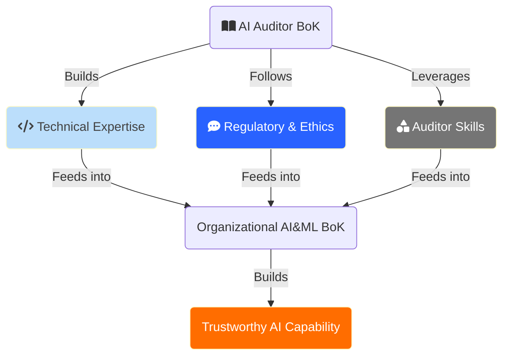

# Towards a Trustworthy AI Program

This repository tries to outline a comprehensive program for setting up an in-house Trustworthy AI initiative or capability group. It's a wide and evolving topic that spans areas beyond technology itself, including ethics, law, social sciences and even philosophy. Therefore this lists the knowledge and capabilities the group of AI auditors should have. 

This takes inspiration from a large number of public papers (arxiv mostly) on the technical side of things, as well as document from regulators, think-tanks and other policy actors.

## Main structure

One could think of structuring this in two main tracks, the Technical (which covers some basics and includes adjacent areas in Security) and the Regulatory, which would include as well the ethical, social and philosophical. A third section covers specific skills for AI auditors.

## ToC

### [Towards Systematic Auditing of AI Models](#towards-an-implementation-of-systematic-auditing-of-ai-models-1)
  - [Challenges](#challenges)
  - [References](#references)

### [Technical Track](#technical-track)
  - [AI / ML Fundamentals](#ai-and-ml-fundamentals)
  - [AI Development Lifecycle](#ai-development-lifecycle)
  - [Transparency and Explainability](#transparency-and-explainability)
  - [Reliability and Robustness](#reliability-and-robustness)
  - [The Security Aspect](#the-security-aspect)
    - [AI Security Fundamentals](#ai-security-fundamentals)
    - [Data Privacy and Security](#data-privacy-and-security-technical)
    - [Adversarial AI](#adversarial-attacks)
  - [Model Validation and Testing](#model-validation-and-testing)
  - [On Syntethic data](#on-synthetic-data)

### [Regulatory Track](#regulatory)
  - [Trustworthy AI](#trustworthy-ai)
  - [AI Assurance](#ai-assurance)
  - [Legal and Regulatory Compliance](#legal-and-regulatory-compliance)
  - [Data Privacy Protection](#data-privacy-protection)
  - [Model Validation and Testing](#model-validation-and-testing)
  - [Synthetic Data Considerations](#synthetic-data-considerations)
  - [Governance](#governance)
    - [Organizational](#organizational)
    - [Ethical AI Principles](#ethical-ai-principles)
    - [Ethics Requirements](#ethics-requirements)
    - [AI Governance Frameworks](#ai-governance-frameworks)
    - [AI Safety](#ai-safety)
    - [Sustainability Considerations](#sustainability-considerations)

### [On Auditing and Assessments](#auditing-and-assessments)
  - [Audit Planning and Scoping](#audit-planning-and-scoping)
    - [Risk management in AI Auditing](#risk-management-in-ai-auditing)
    - [Audit Execution Techniques](#risk-management-in-ai-auditing)
    - [AI Auditing Tools and Platforms](#ai-auditing-tools-and-platforms)
  - [Specialized AI Auditing Skills](#specialized-ai-auditing-skills)
    - [Bias Detection and Mitigation](#bias-detection-and-mitigation)
    - [AI Performance Metrics](#ai-performance-metrics)
    - [AI Documentation and Traceability](#ai-documentation-and-traceability)
    - [Programming for AI Auditing](#programming-for-ai-auditing)
  - [Soft Skills for AI Auditors](#soft-skills-for-ai-auditors)
    - [Critical & Ethical Decision Making](#critical--ethical-decision-making)
    - [Communication and Stakeholder Management](#communication-and-stakeholder-management)

### [Additional Stuff](#additional)
- [Tools, Templates, Checklists](#tools-templates-checklists)
  - [Some Commercial Auditing Tools](#links-regarding-commercial-auditing-tools)
- [Specialized Trainings](#specialized-trainings)
  - [Certifications](#certifications)
- [Other Books & Papers](#other-books--papers)
- [Vendor links](#vendor-links)

 

## Goal

 

Disclaimer

__Although I harbour encyclopedical ambitions, this tsundoku-ish repo can only be a work in progress, part learning journey, part intellectual pursuit, and does not intend to be a final one stop shop__

The ultimate goal is to build a BoK for a team of AI Auditors inside an organization, according to the definition of [Body of Knowledge](https://en.wikipedia.org/wiki/Body_of_knowledge#:~:text=August%202022,representation%20by%20any%20knowledge%20organization.) offered by Wikipedia.

__No affiliation links whatsoever__.

 
 

# Towards an implementation of Systematic Auditing of AI Models

While still a developing field, the systematic auditing of AI models is a growing field aimed at ensuring fairness, transparency, and ethical alignment in AI systems. It incorporates theories and practices from multiple fields.

Comprehensive auditing frameworks have to 

- consider multiple dimensions like governance, strategy, performance, monitoring, review, and communication in both the technical aspects (e.g. model accuracy) and the ethical considerations
- adhere and evolve as the standards and regulations evolve (such as ISO/IEC 42001:2023, the EU regulations on AI and Digital Services etc)
 - evaluate the selection of monitoring metrics, their relevance, and procedures for addressing identified problems

and will need to include

- the entire AI lifecycle, from problem definition and data collection to model development, deployment, and monitoring
- stakeholder with potentially varying interests, ethical metrics, and relevancy matrices to connect metrics to stakeholder interests and the alignment with stated corporate missions / visions

## Challenges

One of the primary obstacles is the absence of widely adopted, standardized frameworks specifically designed for AI auditing, so many organizations are creating theirs, mostly copying each other in the rush to build (and sell) this capability.

- AI systems and solutions vary widely, making it difficult to create a one-size-fits-all audit framework
- The field is constantly evolving, requiring auditors to continuously update their knowledge and adapt their techniques, and in many cases, audits will require specialized domain knowledge
- AI systems tend to be highly complex, involving various technologies and processes, which complicates the creation of comprehensive audit procedures
- their black-box nature
  - Difficulty in tracing decision pathways in transformer architectures
  - Emergent behaviors may not be apparent during initial testing
  - Complex interactions between model components
- Different regulatory bodies may have distinct requirements
- The skills gap
- Inconsistent or incomplete documentation, and lack of standards
- Difficulty in validating the quality of massive training datasets, which can probably be done with programming, automation or additional AI but which requires careful review and oversight, especially in sensitive use cases.

Many more challenges are outlined in the [dedicated page](./pages/challenges.md)

## Step by Step E2E Audit Process

See [dedicated page](./pages/process.md)

## References

- [(ISACA) Auditing AI Report](https://ec.europa.eu/futurium/en/system/files/ged/auditing-artificial-intelligence.pdf), which examines challenges to the AI Auditor and ties the application of ISACA's own COBIT to Auditing AI models. 
- [AI Algorithm Audits: Key Control Considerations](https://www.isaca.org/resources/news-and-trends/industry-news/2024/ai-algorithm-audits-key-control-considerations)
- [An In-Depth Guide To Help You Start Auditing Your AI Models](https://censius.ai/blogs/ai-audit-guide)
- [Towards Auditable AI Systems - From Principles to Practice](https://www.hhi.fraunhofer.de/fileadmin/Departments/AI/TechnologiesAndSolutions/AuditingAndCertificationOfAiSystems/2022-05-23-whitepaper-tuev-bsi-hhi-towards-auditable-ai-systems.pdf)
- [Towards Auditable AI Systems - Current status and future directions](https://www.hhi.fraunhofer.de/fileadmin/Departments/AI/TechnologiesAndSolutions/AuditingAndCertificationOfAiSystems/2021-05-04-whitepaper-tuev-bsi-hhi-towards-auditable-ai-systems.pdf)

 
 

# Technical Track

## AI and ML Fundamentals

Get more than a passing familiarity with the underlying technology and main paradigms. 

- Introduction to AI and ML
  - [Basic concepts and terminology](https://medium.com/nlplanet/the-basic-concepts-and-terms-you-need-to-know-for-ai-and-ml-28eb07fd6c49)
- Types of ML and AI systems
  - Basic understanding of the types of Machine Learning: Supervised, Unsupervised, Semi-supervised, and Reinforcement Learning, Self-supervised, Online, [Transfer](https://aws.amazon.com/what-is/transfer-learning/) etc ([ref](https://ifoadatascienceresearch.github.io/tutorial/comparison/), [ref](https://blogs.nvidia.com/blog/supervised-unsupervised-learning/))
  - [Basic Algorithms](https://www.tableau.com/data-insights/ai/algorithms)
  - How AI, ML and Deep Learning are [related](./pages/ai_overview.md).
  - Neural networks ([FNN, RNN, CNN, LSTM](./pages/neural_networks_overview.md), [Transformer](https://arxiv.org/abs/1706.03762)) and [backpropagation](https://cklixx.people.wm.edu/teaching/math400/Annette-paper.pdf)
- Machine learning algorithms and techniques ([coursera](https://www.coursera.org/articles/machine-learning-algorithms), [comprehensive overview](https://machinelearningmastery.com/a-tour-of-machine-learning-algorithms/), [a simple list](https://medium.com/@price_kj/list-of-all-machine-learning-ml-algorithms-7c839f8c0d73), [the wikipedia rabbit hole](https://en.wikipedia.org/wiki/Category:Machine_learning_algorithms))

## AI Development Lifecycle

Understand all the stages of the AI & ML Development Lifecycle and what each stage entails. [More detail here](./pages/aiml_dev_lifecycle.md)

In truth, it can be said that ML training has 4 phases, the first of which is checking whether the problem can be solved by non-ML means. As defined in [Designing Machine Learning Systems](https://www.oreilly.com/library/view/designing-machine-learning/9781098107956/), therefore we can think of the following 4 basic phases:
  - Phase 1. Before machine learning non-ML solutions can be used to solve the problem, and if they work fine, there may be no need to move to ML.
  - Phase 2. check if simplest machine learning models do the job. things like logistic regression, gradient-boosted trees, and k-nearest neighbors can be  used to validate the problem framing and data.
  - Phase 3. Optimizing simple models, with different objective functions, hyperparameter search, feature engineering, more data, and ensembles. 
  - Phase 4. Complex models, if the previous options did not work as expected or we want to go deeper. Resorting to complex models is also a means of experimentation to try and improve model performance. 

These are aspects that an auditor for Trustworthy AI should probably be looking at. 

Refer to the [Tools, templates and Checklists section](#tools-templates-checklists) for guidance on these lifecycle stages.

- Understand the different roles involved, from data scientist to [AI product owner](https://www.datascience-pm.com/ai-product-owner/)
- Problem Scoping - a specific problem must have been defined which was decided was best approached via AI/ML. This is a critical step that shapes the entire project/product. A well-defined problem helps streamline data collection, model development, and ensures the solution works as intended. This is where an AI product manager plays a key role.
- Data collection and preparation. [Evaluate](https://arxiv.org/abs/2303.01998) things like
  - data quality - dedicated separate page on [data quality](./pages/data_qa.md) 👈
  - completeness
  - consistency
  - relevance to the problem (hence need to have a clear scope and problem formulation in previous step)
  - contextual appropriateness: Does the data represent the real-world context accurately? dimensions like time, location, scenario etc
  - bias and variety
  - how data has been sourced / procured, including provenance and dcumentation and trustworthiness of sources
- [Labeling and augmentation](./pages/label_aug.md)

  - how data has been cleaned, processed, improved ([A 2024 Survey of ETL tools](https://arxiv.org/pdf/2406.08335))
  - [treatment of outliers](https://www.neuraldesigner.com/blog/effective-outlier-treatment-methods-machine-learning/)
  - [normalization and scaling](https://www.geeksforgeeks.org/normalization-and-scaling/)

- Model selection - model selection is about picking the best performing model, not about tuning it for its best performance, which is hyperparameter tuning and comes later. This is about choosing the appropriate algorithm(s) based on the nature of the problem (e.g., classification, regression, clustering). This may involve selecting traditional machine learning models or deep learning architectures, depending on complexity and scale.
- Training and Training phases

  - [Hyperparameter Tuning](https://arxiv.org/abs/2003.05689) : Adjust hyperparameters (e.g., learning rate, regularization factors) to optimize the model's performance. Techniques such as grid search, random search, or more advanced approaches like Bayesian optimization are often employed ([Hyperparameter Optimization For Compute Efficient Training](https://arxiv.org/abs/2306.08055), [Hyperparameters in Reinforcement Learning and How To Tune Them](https://arxiv.org/abs/2306.01324))
  - [Cross-Validation](./pages/cross_valid.md), to evaluate a model's performance and generalization ability. This allows to obtain a better estimate of a model's performance on previously unseen data compared to a classic train-test split. By testing the model on multiple subsets of data, cross-validation helps detect and prevent the classic issue of overfitting.
- [Performance](https://neptune.ai/blog/performance-metrics-in-machine-learning-complete-guide) [metrics](https://www.analyticsvidhya.com/blog/2019/08/11-important-model-evaluation-error-metrics/) - what were the performance metrics for the AI system.
  - [Metrics to evaluate ML algorithms](https://towardsdatascience.com/metrics-to-evaluate-your-machine-learning-algorithm-f10ba6e38234)
- [Bias and Fairness testing](./pages/bias.md)
  - [Managing bias and unfairness in data for decision support](https://link.springer.com/article/10.1007/s00778-021-00671-8)
  - [Investigating Bias with a Synthetic Data Generator](https://arxiv.org/abs/2209.05889)
  - [Towards a Standard for Identifying and Managing Bias in Artificial Intelligence](https://nvlpubs.nist.gov/nistpubs/SpecialPublications/NIST.SP.1270.pdf)
- Interpretability and Explainability
  - [Explaining Explanations: An Overview of Interpretability of Machine Learning](https://arxiv.org/pdf/1806.00069)
  - SHAP (Shapley Additive Explanations) - 
    - [original paper](https://arxiv.org/pdf/1705.07874) 
    - [site](https://shap.readthedocs.io/en/latest/)
  - LIME (Local Interpretable Model-agnostic Explanations)
    - [paper](https://arxiv.org/abs/1602.04938)
    - [paper with code](https://github.com/marcotcr/lime)
- [Deployment and monitoring](https://configr.medium.com/ai-model-deployment-and-monitoring-f458a8a8c725) - a undeployed model is worthless, and an unmonitored one is a risk. There are a number of issues
  - [Conceptual drift](https://reunir.unir.net/bitstream/handle/123456789/14409/a_survey_on_machine_learning.pdf?sequence=1&isAllowed=y) - The underlying data distribution that the model was trained on can shift over time, leading to model performance degradation. As an auditor this is akin to fit for purpose over time and how this is controlled and accounted for, what strategies are in place?
  - [Quality drift](https://www.researchgate.net/publication/373610141_Explainable_Artificial_Intelligence-Based_Model_Drift_Detection_Applicable_to_Unsupervised_Environments) - similarly, data might drift over time or, worse, production data is different to the data the model was trained on. As an auditor, you want to check this and get a sample of both sets of data, at least, to examine this.
  - General monitoring - classic infra monitoring concerns, such as SLAs, infra failures, latencies, scalability etc.

    - [Monitoring Checklist: 7 Things to Track](https://towardsdatascience.com/a-machine-learning-model-monitoring-checklist-7-things-to-track-2042be98a7b5)
    - [Checklist for AI Deployment](https://www.usaid.gov/sites/default/files/2023-07/Artificial%20Intelligence%20Ethics%20Checklist.pdf)

 

## Transparency and Explainability

Dedicated pages 👉 __[Transparency](./pages/transparency.md)__ and on __[algorithmic transparency](./pages/algo_trans.md)__

- [Transparency](./pages/transparency.md) and explainability - Techniques to make AI models more interpretable and their decisions more understandable, understand how models arrive at their decisions. Explainable AI (XAI) techniques: 
  - [Explainable Artificial Intelligence (XAI): What we know and what is left to attain Trustworthy Artificial Intelligence](https://www.sciencedirect.com/science/article/pii/S1566253523001148)
  - [XAI 2.0 paper](https://arxiv.org/abs/2310.19775)
  - [A Survey Of Methods For Explaining Black Box Models](https://arxiv.org/abs/1802.01933)
- [Algorithmic Transparency](https://en.wikipedia.org/wiki/Algorithmic_transparency) - Algorithmic transparency is high on the agenda for regulation (for example, [EU](https://algorithmic-transparency.ec.europa.eu/index_en), [EU Governance Framework for AT](https://www.europarl.europa.eu/RegData/etudes/STUD/2019/624262/EPRS_STU(2019)624262_EN.pdf), [UK](https://www.gov.uk/government/collections/algorithmic-transparency-recording-standard-hub)). As an auditor, ensure information about the algorithms used in AI systems is clear. Apart from techniques such as SHAP, LIME, XAI techniques (see above), basic lifecycle considerations apply, that is:   
  - Detailed records of algorithms used, decision criteria, data sources and preprocessing steps done, model architecture chosen and rationale and training procedures. Data lineage tools can support auditing this aspect of AI&ML models. 
  - For Black box models, providing query access to the model without exposing internal implementation 
    - [Interpreting Black-Box Models: A Review on Explainable Artificial Intelligence](https://link.springer.com/article/10.1007/s12559-023-10179-8) 
    - [A Survey Of Methods For Explaining Black Box Models](https://arxiv.org/abs/1802.01933) 
    - [Interpretable machine learning: Fundamental principles and 10 grand challenges](https://arxiv.org/abs/2103.11251) 
    - [Peeking Inside the Black-Box: A Survey on Explainable Artificial Intelligence (XAI)](https://www.academia.edu/62024109/Peeking_Inside_the_Black_Box_A_Survey_on_Explainable_Artificial_Intelligence_XAI_) 
    - [XAI Handbook: Towards a Unified Framework for Explainable AI](https://arxiv.org/abs/2105.06677)
    - [A Comprehensive Taxonomy for Explainable Artificial Intelligence: A Systematic Survey of Surveys on Methods and Concepts](https://arxiv.org/abs/2105.07190)
    - [A Review of Taxonomies of Explainable Artificial Intelligence (XAI) Methods](https://dl.acm.org/doi/pdf/10.1145/3531146.3534639)
    - [Explainable artificial intelligence: an analytical review](https://www.semanticscholar.org/paper/Explainable-artificial-intelligence%3A-an-analytical-Angelov-Soares/0ca9a5ef7695fdaa65325761164c70e56739a902)
    - [Explainable AI: A Review of Machine Learning Interpretability Methods](https://www.semanticscholar.org/reader/f156ecbbb9243522275490d698c6825f4d2e01af)
  - Transparency reports including regular updates on changes to AI systems and disclosure of known limitations or biases.

  More references [here](./pages/algo_trans.md)

- [Interpretability](https://www.managementsolutions.com/sites/default/files/minisite/static/22959b0f-b3da-47c8-9d5c-80ec3216552b/iax/pdf/explainable-artificial-intelligence-en-04.pdf) of AI/ML models
  - [An Overview](https://www.blog.trainindata.com/machine-learning-interpretability/)
  - [Distinguish](https://docs.aws.amazon.com/whitepapers/latest/model-explainability-aws-ai-ml/interpretability-versus-explainability.html) between Explainability and Interpretability
  - [The Mythos of Model Interpretability](https://arxiv.org/pdf/1606.03490)
  - [Making Sense of Machine Learning: A Review of Interpretation Techniques and Their Applications](https://www.mdpi.com/2076-3417/14/2/496)

- [Differential privacy](./pages/diff_priv.md)
  - [OpenDP Framework](https://docs.opendp.org/en/stable/index.html)
  - [differentialprivacy.org](https://differentialprivacy.org/), which also lists a number of books, tools, courses and stuff in the [resources page](https://differentialprivacy.org/resources/)
  - [A friendly, non-technical introduction to differential privacy](https://desfontain.es/blog/friendly-intro-to-differential-privacy.html)
  - [Hands-On Differential Privacy](https://www.oreilly.com/library/view/hands-on-differential-privacy/9781492097730/)
  - [TensorFlow Privacy library](https://github.com/tensorflow/privacy), which can be used to train privacy-preserving ML models with minimal code changes to existing TensorFlow code
  - [Opacus library](https://opacus.ai/), which can be used to train PyTorch models while enabling [Differential privacy](./pages/diff_priv.md).

- [Platform Observability](https://ojs.weizenbaum-institut.de/index.php/wjds/article/view/4_2_3) - this interesting paper seeks to go beyond Algorithmic Transparency to "_platform observability: a pragmatic and sociotechnical perspective aimed at securing structural, real-time access to the means of platform knowledge production_", applying the classic concept of Observability *as a pragmatic alternative to algorithm-centric models of platform transparency*. 

  As an auditor there are several [evidence gathering techniques](./pages/evidence_gather.md) available to you. 

## Reliability and Robustness

- [AI Maintenance: A Robustness Perspective](https://arxiv.org/pdf/2301.03052)
- Model performance evaluation - going beyond the [basic accuracy metrics](https://c3.ai/introduction-what-is-machine-learning/evaluating-model-performance/), such as precision, recall, F1-score, and AUC-ROC, to provide a holistic view of model performance
  - [cross-validation and other techniques](https://www.markovml.com/blog/model-evaluation-metrics) to ensure the model's performance is consistent across different subsets of data
- Error analysis and [debugging](https://www.markovml.com/blog/ml-model-debugging)
  - [Confusion Matrix Analysis](https://en.wikipedia.org/wiki/Confusion_matrix) which examines the types of errors (false positives, false negatives) to understand where the model struggles2.
  - Feature Importance: Analyzing which features contribute most to correct and incorrect predictions through different [techniques](https://www.aporia.com/learn/feature-importance/feature-importance-7-methods-and-a-quick-tutorial/). - [Comparison of feature importance measures as explanations for classification models](https://link.springer.com/article/10.1007/s42452-021-04148-9)
  - Error Patterns: Identifying systematic errors or biases in the model's predictions.
  - Debugging Techniques: Using techniques like gradient checking, learning curve analysis, and bias-variance decomposition to diagnose issues in model training and performance.
    - [Debugging Machine Learning Models with Python](https://www.amazon.es/Debugging-Machine-Learning-Models-Python/dp/1800208588) / ([github repo](https://github.com/PacktPublishing/Debugging-Machine-Learning-Models-with-Python))
- Handling edge cases and outliers, something that is also related to red teaming models and adversarial assessments

## The Security aspect

### AI Security Fundamentals
- Threat modeling for AI systems
  - [MLSecOps](https://mlsecops.com/)
  - [Threat Modeling AI/ML Systems and Dependencies](https://learn.microsoft.com/en-us/security/engineering/threat-modeling-aiml)
  - [Threat Modelling and Risk Analysis for Large Language Model (LLM)-Powered Applications](https://arxiv.org/abs/2406.11007)
  - [Introducing Google’s Secure AI Framework](https://blog.google/technology/safety-security/introducing-googles-secure-ai-framework/) - this page includes a summary of SAIF and examples for practitioners

- Common attack vectors and vulnerabilities - [OWASP Machine Learning Security Top Ten](https://owasp.org/www-project-machine-learning-security-top-10/)

### Data Privacy and Security (technical)

- Audit implementation of access controls, security measures, encryption techniques, and safeguards in place to protect data in AI/ML models. 
- How do AI systems manage data
- [Anonymization techniques](https://www.privacydynamics.io/post/data-anonymization-in-ai-a-path-towards-ethical-machine-learning/)
  - [Anonymizing Machine Learning Models](https://arxiv.org/pdf/2007.13086)
  - [Towards Personal Data Identification and Anonymization using Machine Learning Techniques](https://www.researchgate.net/profile/Francesco-Di-Cerbo/publication/327315236_Towards_Personal_Data_Identification_and_Anonymization_Using_Machine_Learning_Techniques_ADBIS_2018_Short_Papers_and_Workshops_AIQA_BIGPMED_CSACDB_M2U_BigDataMAPS_ISTREND_DC_Budapest_Hungary_September/links/5cb9efab4585156cd7a46cfa/Towards-Personal-Data-Identification-and-Anonymization-Using-Machine-Learning-Techniques-ADBIS-2018-Short-Papers-and-Workshops-AIQA-BIGPMED-CSACDB-M2U-BigDataMAPS-ISTREND-DC-Budapest-Hungary.pdf)
- [Securing the data pipeline](https://cloud.google.com/blog/topics/threat-intelligence/securing-ai-pipeline/) to prevent unauthorized access or breaches.

### Adversarial Attacks
- [(NIST) Adversarial ML - A Taxonomy and Terminology of Attacks and Mitigations](https://nvlpubs.nist.gov/nistpubs/ai/NIST.AI.100-2e2023.pdf)
- [Overview of different techniques](https://medium.com/game-of-bits/adversarial-examples-and-defence-mechanisms-against-them-e71892e87b33)
- [White Box & Black Box](https://deepgram.com/ai-glossary/adversarial-machine-learning)
- [Types of adversarial attacks](https://viso.ai/deep-learning/adversarial-machine-learning/) 
  - [Evasion](https://arxiv.org/abs/2406.08050) - Evasion attacks aim to manipulate the input to an AI model during inference time to cause incorrect outputs or predictions
  - [Poisoning, data poisoning](https://owasp.org/www-project-machine-learning-security-top-10/docs/ML02_2023-Data_Poisoning_Attack) - a strategy where attackers inject corrupted data into the machine learning pipeline, causing the model to learn incorrect patterns and make erroneous predictions. As an auditor, understand what type of attack this is and check the measures in place to prevent it. 
  - [Model Extraction attacks](https://arxiv.org/pdf/2312.05386)
  - [Other types of attacks](./pages/attacks.md)
- Understand techniques such as [Untargeted, Targeted and Universal Adversarial
Attacks](https://arxiv.org/pdf/2101.05639), FGSM, JSMA, Deepfool, Limited-Memory BFGS, [Carlini & Wagner Attack](https://arxiv.org/abs/1608.04644), how GANs can be used to generate adversarial attacks, Zeroth-order optimization attack and others.
  - [Adversarial Attacks and Defenses in Deep Learning](https://www.sciencedirect.com/science/article/pii/S209580991930503X)

- Generating and detecting [adversarial examples](https://arxiv.org/pdf/1712.07107)
  - Ability to create adversarial inputs for various types of AI models
  - Ability to assess AI models' resilience against adversarial attacks
- Defenses against adversarial attacks - understanding how techniques like adversarial training, defensive distillation and gradient masking/obfuscation work and are applied

### AI System Hardening
- Secure AI development practices 
  - [NIST Secure Software Development Practices for GenAI](https://nvlpubs.nist.gov/nistpubs/SpecialPublications/NIST.SP.800-218A.pdf)
  - [UK Guidelines for secure AI system development](https://www.ncsc.gov.uk/files/Guidelines-for-secure-AI-system-development.pdf)
- [Red teaming](https://arxiv.org/abs/2404.00629) - AI/ML Red Teaming is a structured security testing approach designed to identify vulnerabilities, weaknesses, and potential risks in artificial intelligence and machine learning systems before they can be exploited by malicious actors. This practice involves simulating real-world attacks on AI models to assess their resilience and improve their security posture. As an AI / ML Auditor it is important to have tools and understand how vulnerabilities, weaknesses and hidden flaws can be detected, not only for regulatory compliance but also for mere [risk mitigation](https://nvlpubs.nist.gov/nistpubs/ai/nist.ai.100-1.pdf). Similarly, red teaming can help ensure that AI models adhere to ethical standards and societal expectations without compromising their effectiveness (ethical alignment). Red teaming is essential to improve the resiliency of models against unexpected or adversarial input, which in turn, possitively affects the previous aspects mentioned. 
  - [Red Teaming Language Models with Language Models](https://arxiv.org/abs/2202.03286)
  - [Learning diverse attacks on large language models for robust red-teaming and safety tuning](https://arxiv.org/abs/2405.18540)
  - [Red Teaming Language Models to Reduce Harms: Methods, Scaling Behaviors, and Lessons Learned](https://arxiv.org/abs/2209.07858)
  - [Exploring Straightforward Conversational Red-Teaming](https://arxiv.org/abs/2409.04822)
  - [AgentPoison: Red-teaming LLM Agents via Poisoning Memory or Knowledge Bases](https://arxiv.org/abs/2407.12784)
  - [SocioTechnical Approach to Red Teaming Language Models](https://arxiv.org/abs/2406.11757)
  - [Red-Teaming for Generative AI, Silver Bullet or Security Theater](https://arxiv.org/pdf/2401.15897)

  **Vendor links**
    - [(Microsoft) Planning red teaming for large language models (LLMs) and their applications](https://learn.microsoft.com/en-us/azure/ai-services/openai/concepts/red-teaming)
    - [(Microsoft) PyRIT Framework - Python Risk Identification Toolkit for generative AI](https://www.microsoft.com/en-us/security/blog/2024/02/22/announcing-microsofts-open-automation-framework-to-red-team-generative-ai-systems/) - [github code](https://github.com/Azure/PyRIT)
  - [(Lakera) Red Teaming LLM's ](https://www.lakera.ai/blog/ai-red-teaming)
  - [(Google) AI Red Team report](https://services.google.com/fh/files/blogs/google_ai_red_team_digital_final.pdf) - [site](https://blog.google/technology/safety-security/googles-ai-red-team-the-ethical-hackers-making-ai-safer/)

- Model and data protection techniques
  - [Three Challenges to Secure AI Systems in the Context of AI Regulations](https://www.researchgate.net/publication/380015990_Three_challenges_to_secure_AI_systems_in_the_context_of_AI_regulations)

 

## On Synthetic data

Synthetic data is a field that's [evolving fast](https://www.researchgate.net/publication/383910617_Advancements_in_Synthetic_Data_Generation_A_Comprehensive_Exploration_of_Generative_Models_Privacy-Preserving_Techniques_and_Real-World_Applications_Across_Industries) and attracting interest from multiple industries and regulators. It offers [interesting use cases](https://www.researchgate.net/publication/357007527_Synthetic_data_use_exploring_use_cases_to_optimise_data_utility) in the training of ML & AI models, offering diverse and controlled datasets (ideally) that enhance model performance while minimizing privacy risks, reducing undesirable biases and in some cases, where socially desirable, injecting appropriate biases to reduce inequities. We explore more links on this topic [later in this document](#synthetic-data-considerations), from a governance point of view. However, from a more technical perspective, an AI auditor should be familiar with the [opportunities and risks](https://arxiv.org/pdf/2309.00652) of the use of synthetic data:

- Understand the growing relevance of synthetic data and
  - applicability for addressing data deficits and representation concerns
  - privacy protection and bias or imbalance
  - economic considerations, where synthetic data can be cheaper that real world data collection
  - compliance reasons
- Concerns around Synthetic Data Generation and Security. Complementing the previous pros, there are cons around the use of synthetic data:
  - data quality issues leading to inaccurate or less reliable models
  - risks around reverse engineering, hence [differential privacy](./pages/diff_priv.md), which, in principle, offers a mathematically robust solution to generate synthetic data that reliably retains thethe statistical characteristics of the original while protecting privacy. Nonetheless, a key concern remains: how can we guarantee that synthetic data cannot be reversed, potentially revealing sensitive information? This includes IP risks too
  - [data pollution/contamination](https://arxiv.org/abs/2405.09597): As more synthetic data is used, it becomes harder to separate synthetic from real data and identify sources of bias, or models could get what one could call [mad cows disease for AI models](https://arxiv.org/abs/2307.01850)
- Presence of Bias in Synthetic Data, including bias propagation - [How to Validate the Quality of Your Synthetic Data](https://towardsdatascience.com/how-to-validate-the-quality-of-your-synthetic-data-34503eba6da)
- [Validation](https://arxiv.org/abs/2310.16052) and Testing with Synthetic Data 

More [here](#synthetic-data-considerations)

 

# Regulatory

## Trustworthy AI

[On the idea of TAI](./pages/trustworthy_ai.md)

-  [EU HLEG AI Guidelines](https://digital-strategy.ec.europa.eu/en/library/ethics-guidelines-trustworthy-ai)
- [China CAICT White Paper on TAI](http://www.caict.ac.cn/english/research/whitepapers/202110/P020211014399666967457.pdf)
 
## AI Assurance

[On AI Assurance](./pages/assurance.md)

## Legal and Regulatory Compliance

- Need to have an understanding of the different AI regulations or frameworks (e.g., [EU AI Act](https://www.europarl.europa.eu/topics/en/article/20230601STO93804/eu-ai-act-first-regulation-on-artificial-intelligence), [NIST AI Risk Management Framework](https://www.nist.gov/itl/ai-risk-management-framework)) referenced elsewhere in this document, in order to leverage them and understand which ones might apply in each specific audit scenario.
- Sector-specific AI regulations, use cases and applications.There are many of those. Some relevant examples:
  - [Financial Industry Regulatory Authority (FINRA) AI/ML Guidelines](https://www.finra.org/rules-guidance/key-topics/fintech/report/artificial-intelligence-in-the-securities-industry/ai-apps-in-the-industry). The notes to this document provide additional sector-specific links
  - AI in credit scoring and fraud detection, with its own set of biases and risks
  - Algorithmic trading and risk management
  - [In HR and Hiring](https://www.eeoc.gov/laws/guidance/americans-disabilities-act-and-use-software-algorithms-and-artificial-intelligence)
  - In Healthcare, with specializations such as AI in medical diagnosis and treatment planning and its plethora of accompanying ethical and data privacy considerations.
  - Manufactoring, IoT, such as AI in predictive maintenance and quality control or safety considerations for AI-powered robotics

## Data Privacy Protection
- [GDPR](https://eur-lex.europa.eu/legal-content/EN/TXT/PDF/?uri=CELEX:32016R0679), [CCPA](https://cppa.ca.gov/regulations/pdf/cppa_act.pdf) and other relevant data protection regulations
- Associated risks and Privacy-preserving AI techniques
  - [Privacy Risks of General-Purpose AI Systems](https://arxiv.org/abs/2407.02027)

## Model Validation and Testing

- Testing for performance, see [performance metrics](#ai-performance-metrics)
- Testing for reliability
  - [Accuracy of training data and model outputs in Generative AI](https://arxiv.org/pdf/2407.13072)
  - [Reliability in Machine Learning](https://www.researchgate.net/publication/380151336_Reliability_in_Machine_Learning)
  - [Statistical perspectives on reliability of artificial intelligence systems](https://www.researchgate.net/publication/362970158_Statistical_perspectives_on_reliability_of_artificial_intelligence_systems)
- Testing for compliance with expected/stated outcomes

## Synthetic Data Considerations

- [Data Privacy and Synthetic Data](./pages/synth_data.md)
- Ethical and Regulatory Compliance in Synthetic Data Usage 
  - [Ethical Challenges of Using Synthetic Data](https://ojs.aaai.org/index.php/AAAI-SS/article/download/27490/27263/31541)
  - [Synthetic Data in AI: Challenges, Applications, and Ethical Implications](https://arxiv.org/pdf/2401.01629v1)

## Governance

Good overview and understanding of the main topics around Ethics and Governance and what Regulators, think-tanks and industry groups of interest are putting out that affects the evaluation and assessments of models, and also guides the auditor be aligned in terms of compliance and potential certification of AI & ML models. 

Understand as well the social, economical, ethical and [philosophical](https://intelligence.org/files/EthicsofAI.pdf) derivations of the technology.

### Organizational

While not exactly regulatory, in this track, as an auditor you will want to check what AI Policy a given organization might / should have in place.

- Organizational AI policies in place
- Accountability and responsibility

### Ethical AI Principles

Basic guidance such as that provided by the [OECD AI Policy Observatory](https://oecd.ai/en/) and its [AI Principles](https://oecd.ai/en/ai-principles) will help any organization put in place their own principles as well as offer a guide as to what aspects to look for and evaluate in AI/ML models. 

- Fairness and non-discrimination - Group and Individual Fairness, techniques to mitigate bias in training data and model outputs. Bias Detection and Mitigation and methods to identify and reduce unfair bias in AI systems.
  - [The Fairness and ML Book](https://fairmlbook.org/)
  - [A Survey on Bias and Fairness in Machine Learning](https://arxiv.org/abs/1908.09635)

- Data Privacy considerations. General sound privacy and data protection regulation and standard guidelines apply here; collect and use only the necessary data for AI system functionality, protect sensitive data.

### Ethics Requirements
  - [EU AI HLEG - High-level expert group on artificial intelligence](https://digital-strategy.ec.europa.eu/en/policies/expert-group-ai)
  - [IEEE Ethically Aligned Design](https://standards.ieee.org/wp-content/uploads/import/documents/other/ead_v2.pdf)
  - [Ethical Requirements for AI Systems](https://www.researchgate.net/publication/339886423_Ethical_Requirements_for_AI_Systems)
  - [IEEE Standard Model Process for Addressing Ethical Concerns during System Design](https://www.aditicorp.com/wp-content/uploads/2024/09/7000-2021.pdf)

  

### AI Governance Frameworks
- Regulatory landscape and compliance requirements
  - [EU AI Act](https://www.europarl.europa.eu/topics/en/article/20230601STO93804/eu-ai-act-first-regulation-on-artificial-intelligence), a comprehensive first-of-its-kind regulation categorizing AI systems based on risk levels and imposing corresponding requirements
  - [General Data Protection Regulation (GDPR)](https://eur-lex.europa.eu/legal-content/ES/TXT/?uri=celex%3A32016R0679)
  - [The AIGA AI Governance Framework](https://ai-governance.eu/)
  - [Putting AI Ethics into Practice: The Hourglass Model of Organizational AI Governance](https://arxiv.org/abs/2206.00335)
  - [NIST AI Risk Management Framework](https://www.nist.gov/itl/ai-risk-management-framework), which focuses on managing risks associated with AI systems and rovides guidance on governance, mapping, measuring, and managing AI risks / [standard (PDF)](https://nvlpubs.nist.gov/nistpubs/ai/NIST.AI.600-1.pdf)
  - [OECD Principles on Artificial Intelligence](https://www.oecd.org/en/topics/policy-issues/artificial-intelligence.html), emphasizes human-centered values and fairness
  - [European Commission's Ethics Guidelines for Trustworthy AI](https://op.europa.eu/en/publication-detail/-/publication/d3988569-0434-11ea-8c1f-01aa75ed71a1), which is part of the EU's broader AI strategy
Emphasizes seven key requirements: human agency and oversight, technical robustness, privacy and data governance, transparency, diversity and fairness, societal well-being, and accountability
- Industry standards and best practices
  - [IEEE  Standard Model Process for Addressing Ethical Concerns during System Design  (IEEE Std 7000–2021)](https://ieeexplore.ieee.org/document/9536679)
  - [IEEE Global Initiative on Ethics of Autonomous and Intelligent Systems](https://standards.ieee.org/industry-connections/activities/ieee-global-initiative/), which provides a comprehensive set of ethical principles for AI development and covers areas such as transparency, accountability, and privacy protection ([pdf](https://ieee-sa.imeetcentral.com/p/eAAAAAAASwyHAAAAAFNa5fs))
  - Some [ISO Standards for AI](https://www.iso.org/sectors/it-technologies/ai) are:
    - [ISO/IEC DIS 42006](https://www.iso.org/standard/44546.html), forthcoming, and will detail requirements for bodies providing audit and certification of artificial intelligence management systems, so will be important for AI auditors
    - [ISO/IEC 42001:2023](https://www.iso.org/standard/81230.html) - designed for entities providing or utilizing AI-based products or services, this standard specifies requirements for establishing, implementing, maintaining, and continually improving an Artificial Intelligence Management System (AIMS) within organizations. Therefore, it is important for AI Auditors to certify responsible AI in said organizations.
    - [ISO/IEC 23894:2023](https://www.iso.org/standard/77304.html), for AI Risk Management
    - [ISO/IEC 23053:2022](https://www.iso.org/standard/74438.html)
    - [ISO/IEC TR 24027:2021](https://www.iso.org/standard/77607.html), for Bias in AI systems and AI aided decision making
    - [ISO/IEC TS 12791](https://www.iso.org/standard/84110.html), covering the treatment of unwanted bias in classification and regression machine learning tasks

    There are [quite a few more ISO's related to AI](https://www.iso.org/search.html?PROD_isoorg_en%5Bquery%5D=artificial%20intelligence&PROD_isoorg_en%5Bmenu%5D%5Bfacet%5D=standard), far too many to list here, which can be relevant depending on the certification scenario.

- Organizational AI governance structures
  - [AIGA](https://ai-governance.eu/ai-governance-framework/the-ai-governance-lifecycle/)
  - [Defining organizational AI governance](https://link.springer.com/content/pdf/10.1007/s43681-022-00143-x.pdf) (open access journal article)
  - [Toward AI Governance: Identifying Best Practices and Potential Barriers and Outcomes](https://link.springer.com/article/10.1007/s10796-022-10251-y)

### AI Safety
- Risk assessment and mitigation strategies
- Fail-safe mechanisms and graceful degradation
- GenAI Safety considerations
  - [(NIST) Artificial Intelligence Risk Management Framework: Generative Artificial Intelligence Profile](https://nvlpubs.nist.gov/nistpubs/ai/NIST.AI.600-1.pdf)
- Long-term AI & AGI safety considerations
  - All of AI AGI Existential Safety risks papers by [Roman V. Yampolskiy](https://scholar.google.com/citations?user=0_Rq68cAAAAJ&hl=en). It's a long list, and amazing reads, albeit not as pertinent to the work of the AI Auditor. 

### Sustainability Considerations

There are two key topics in this dimension for the AI model auditor.

- Understand the sustainability concerns and trends around AI & ML models.
- Understand tools and techniques to measure and assess the sustainability impact of AI models.

References covering these two topics available in the [dedicated page](./pages/sustain.md). 

 

# Auditing and Assessments

## Audit Planning and Scoping

- Defining audit objectives and scope
- Developing audit criteria and checklists - you probably want to have a fixed checklist covering all common generalities in AI model audit scenarios, and then additional checklist based on the particular domain.

### Risk management in AI Auditing

- Identifying, assessing, and mitigating risks specific to AI models

  - [Identifying and Mitigating the Security Risks of Generative AI](https://www.researchgate.net/publication/373487947_Identifying_and_Mitigating_the_Security_Risks_of_Generative_AI)
  - [A Formal Framework for Assessing and Mitigating Emergent Security Risks in Generative AI Models](https://www.arxiv.org/abs/2410.13897)
  - [(Berkeley) Guidance for the Development of AI Risk and Impact Assessments](https://cltc.berkeley.edu/wp-content/uploads/2021/08/AI_Risk_Impact_Assessments.pdf)
  - [Bias Risk Template](https://ai.bsa.org/wp-content/uploads/2021/06/2021bsaaibiasframework.pdf)

### Audit Execution Techniques
- Data sampling and analysis - examine subsets of both training and test data to assess potential issues with bias, quality, representativeness, protection concerns etc. 
- Data lineage and provenance, integrity. 
- Model evaluation and testing. 
  - Use techniques like LIME or SHAP to explain model predictions, covered elsewhere in this repository. 
  - Stress test model with adversarial examples or edge cases.
  - Feature importance and decision boundaries.
- Source code and model architecture for errors or vulnerabilities.

### AI Auditing Tools and Platforms
- Overview of commercial and open-source auditing tools - [The Right Tool for the Job: Open-Source Auditing Tools in Machine Learning](https://arxiv.org/abs/2206.10613) - see the [tools](#tools-templates-checklists) section below.
- Hands-on experience with selected tools

## Specialized AI Auditing Skills

### Bias Detection and Mitigation
- [Types of AI bias](./pages/types_ai_bias.md)
- Bias measurement techniques
  - [De-biasing "bias" measurement](https://arxiv.org/abs/2205.05770)
- Strategies for reducing bias in AI systems
  - [Mitigating bias in artificial intelligence](https://www.sciencedirect.com/science/article/pii/S0167739X24000694)

### AI Performance Metrics
- Selecting appropriate evaluation metrics
  - [A global analysis of metrics used for measuring performance in natural language processing](https://arxiv.org/abs/2204.11574)
  - [A critical analysis of metrics used for measuring progress in artificial intelligence](https://arxiv.org/pdf/2008.02577)
  - [Principles for Evaluation of AI/ML Model Performance and Robustness](https://arxiv.org/pdf/2107.02868)
  - [Measuring AI Systems Beyond Accuracy](https://arxiv.org/pdf/2204.04211)
  - [Analysis and Comparison of Classification Metrics](https://arxiv.org/abs/2209.05355)
  - [Loss Functions and Metrics in Deep Learning](https://arxiv.org/abs/2307.02694)
- [Benchmarking and comparative analysis](https://mlsysbook.ai/contents/benchmarking/benchmarking.html)
  - [(Azure) Model benchmarks in Azure AI Studio](https://learn.microsoft.com/en-us/azure/ai-studio/how-to/model-benchmarks)
  - [Comparison and Benchmarking of AI Models and Frameworks on Mobile Devices](https://arxiv.org/abs/2005.05085)
  - [Benchmarking of Commercial Large Language Models](https://www.researchgate.net/publication/380421448_Benchmarking_of_Commercial_Large_Language_Models_ChatGPT_Mistral_and_Llama)
- Continuous monitoring of AI systems. Understand how the model under audit is being currently monitored in production. Refer to [development lifecycle section](#ai-development-lifecycle) for more information on deployment and monitoring.
  - [Monitoring AI systems: A Problem Analysis, Framework and Outlook](https://arxiv.org/abs/2205.02562)

### AI Documentation and Traceability

- Documentation review and stakeholder interviews
- Model cards and datasheets - 
  - [Model cards](https://huggingface.co/blog/model-cards) and datasheets- This page is particularly useful as it links to [this related page](https://huggingface.co/docs/hub/model-card-landscape-analysis) that contains references to templates and guidelines for [datasheets](https://www.fatml.org/media/documents/datasheets_for_datasets.pdf) and a [repo with plenty of examples](https://github.com/ivylee/model-cards-and-datasheets). Some of the more relevant links therein are:

    - [A Guide for Writing Data Statements for NLP Models](https://techpolicylab.uw.edu/wp-content/uploads/2021/11/Data_Statements_Guide_V2.pdf)
    - [Reusable Templates and Guides For Documenting Datasets and Models for Natural Language Processing and Generation](https://huggingface.co/papers/2108.07374)
    - [Towards Accountability for Machine Learning Datasets: Practices from Software Engineering and Infrastructure](https://dl.acm.org/doi/pdf/10.1145/3442188.3445918)
    - [Data Cards playbook](https://github.com/PAIR-code/datacardsplaybook/) - [(paper)](Data Cards: Purposeful and Transparent Dataset Documentation for Responsible AI)
- [Version control for AI models and datasets](https://neptune.ai/blog/version-control-for-ml-models) - version control is an idea that should not need selling and which apply to AI model development just as well. 
- Audit trail maintenance
  - [A large-scale audit of dataset licensing and attribution in AI](https://www.nature.com/articles/s42256-024-00878-8)

 

- [Towards Auditable AI Systems](https://www.bsi.bund.de/SharedDocs/Downloads/EN/BSI/KI/Towards_Auditable_AI_Systems_2022.pdf?__blob=publicationFile&v=4)
- [A Blueprint for Auditing Generative AI](https://www.researchgate.net/publication/382080223_A_Blueprint_for_Auditing_Generative_AI)

 

### Programming for AI Auditing
- Basic Python for data analysis and model inspection 
- Using libraries for fairness and explainability (such as [AI Fairness 360](https://aif360.res.ibm.com/) ([paper](https://arxiv.org/abs/1810.01943)) or SHAP)

 

## Soft Skills for AI Auditors

Many Soft Skills for AI Auditors overlap with those needed in strategy consulting, project management, and risk management, especially in high-stakes settings and/or C-levels. One thing for sure is AI auditors need to stay up-to-date with the latest AI technologies, methodologies, and regulatory changes, whereas it might not be the case in more traditional industries or sectors, but apart from that these below are probably standard skills, not specific to AI & ML models auditors.

### Critical & Ethical Decision Making

Dedicated literature and papers on the different dimensions of [AI ethics](https://www.nature.com/articles/s41599-020-0501-9) has exploded since 2016 as shown by [google trends](https://trends.google.es/trends/explore?date=all&q=AI%20ethics). A quick search online shows that everybody has put out their AI Ethics document, probably everyone's rehashing everyone else's and/or creating that through AI. 

- Ability to critically evaluate AI-generated outputs, identify potential biases, and exercise independent judgment in the context of AI without yielding to mental lazyness or AI authority syndrom.
- Develop a healthy skepticism towards AI-generated insights and answers. This point, and the previous one, will most often require solid foundational skills plus specialized domain knowledge. 
- Navigating ethical dilemmas in AI auditing, including privacy, biases,and social and business impact. 

  - [The Ethics of AI Business Practices: A Review of 47 AI Ethics Guidelines](https://papers.ssrn.com/sol3/papers.cfm?abstract_id=4034804)
  - [An Overview of Artificial Intelligence Ethics](https://www.researchgate.net/publication/362334936_An_Overview_of_Artificial_Intelligence_Ethics)
  - [Artificial Intelligence (AI) Ethics: Ethics of AI and Ethical AI](https://www.researchgate.net/publication/340115931_Artificial_Intelligence_AI_Ethics_Ethics_of_AI_and_Ethical_AI)
  - [A High-Level Overview of AI Ethics](https://papers.ssrn.com/sol3/papers.cfm?abstract_id=3609292)
  - [Ethics-Based Auditing to Develop Trustworthy AI](https://www.semanticscholar.org/reader/7ca51263bb2de8a03ed661d19b59c99dc9e1cbb1)

AI ethics is often viewed as a subset of [digital ethics](https://philpapers.org/archive/MLLHOD.pdf) (a subset of [applied ethics](https://www.frontiersin.org/articles/10.3389/fcomp.2022.776837/pdf), in turn), drawing from fields like [engineering ethics](https://en.wikipedia.org/wiki/Engineering_ethics), [philosophy of technology](https://www.sfu.ca/~andrewf/books/What_is_Philosophy_of_Technology.pdf), and science and technology studies. A complete book on the Philosophy of Technology is available [here](https://www.researchgate.net/publication/273947214_The_Philosophy_of_Technology_An_Introduction).

The field of AI ethics has seen significant development and diversification over recent years. The specialized literature in converging on __5 core ethical principles: transparency, justice and fairness, non-maleficence, responsibility, and privacy__. However, the understanding and implementation of those vary regionally and across different sectors/industries. 

Challenges lie as well in 
- conflicting business goals, vested investment interests
- the lack of robust accountability mechanisms in AI development, compared to what exists in fields with much more extense history of practice, such as medicine. 
- the lack of a common framework for Explainable AI (XAI) does not help advance this issue. 
- the gap in ethical knowledge and tools and the difficulty in translating the gap from philosophical discussions around AI Ethics to actionable guidance that can be applied in the AI development lifecycle, and not all organizations will have people well-versed in this.
- lacking or weak implementations of governance frameworks and accountability measures. Effective governance includes mandated controls, audit trails, and ethics boards to oversee AI deployments
- the difficulty in adequately estimating and managing risks associated with AI

What is interesting is that there exists an incrasing interest or focus on the ethical management of AI within organizations, perhaps driven by regulatory and reputational interests. Frameworks like the [Ethical Management of AI (EMMA)](https://www.mdpi.com/2071-1050/13/4/1974) are being proposed to guide managerial decision-making and integrate ethical considerations into AI development and deployment. 

  - [Specific challenges posed by artificial intelligence in research ethics](https://www.semanticscholar.org/paper/Specific-challenges-posed-by-artificial-in-research-Bouhouita-Guermech-Gogognon/c2c4203671dc0f7afd7e61197af3832702c7f7b8)
  - [Beyond the promise: implementing ethical AI](https://www.semanticscholar.org/paper/Beyond-the-promise%3A-implementing-ethical-AI-Eitel-Porter/0a7109502e7fe91f4decc3dd3515e1fecbc02da7)
  - [Ethics of AI: A Systematic Literature Review of Principles and Challenges](https://oulurepo.oulu.fi/bitstream/handle/10024/45173/nbnfi-fe2023033134043.pdf?sequence=1&isAllowed=y)
  - [The Ethics of AI Ethics: An Evaluation of Guidelines](https://link.springer.com/article/10.1007/s11023-020-09517-8)

### Communication and Stakeholder Management

- Explaining technical concepts to non-technical audiences, or mixed audiences composed of including data scientists, ethicists, and domain experts
- Communicating with stakeholders who may have varying levels of AI literacy and different concerns about AI/ML systems. Communicating AI decisions to stakeholders
- Negotiation and conflict resolution in audit scenarios
- Sector-specific knowledge, regulations etc

 

# Additional 

## Tools, Templates, Checklists

- [Self-Assessment list for Trustworthy AI (ALTAI)](https://ec.europa.eu/newsroom/dae/document.cfm?doc_id=68342) (direct PDF download)
- [Microsoft Responsible AI Standard v2 General Requirements](https://query.prod.cms.rt.microsoft.com/cms/api/am/binary/RE4ZPmV)
- [Data Ethics Canvas](https://theodi.org/news-and-events/blog/data-ethics-canvas/)
- [AI Ethics Policy Template](https://www.aiguardianapp.com/ai-ethics-policy-template)
- [AI Ethics Toolkit](https://www.hum-dseg.org/ai-applied-ethics-toolkit)
- [Assessment List for Trustworthy AI (ALTAI)](https://op.europa.eu/en/publication-detail/-/publication/73552fcd-f7c2-11ea-991b-01aa75ed71a1)
- [NOREA Guiding Principles Trustworthy AI Investigations](https://www.norea.nl/uploads/bfile/a344c98a-e334-4cf8-87c4-1b45da3d9bc1)
- [UK A Guide to ICO Audit Artificial Intelligence (AI) Audits](https://ico.org.uk/media/for-organisations/documents/4022651/a-guide-to-ai-audits.pdf)
- [AI Incident Database](https://incidentdatabase.ai/)
- [LatticeFlow's](https://latticeflow.ai/solutions/ai-assessments/) - for example involved in the [EU AI Act compliance assessment](https://opentools.ai/news/eu-ai-act-compliance-checker-reveals-tech-giants-weak-spots?utm_source=opentoolsai-newsletter&utm_medium=newsletter&utm_campaign=ai-compliance-shocker&_bhlid=6fb422971ae5f7227094d0d7914074df7eaf8b5c)
- [Toolkit for "TrustLLM: Trustworthiness in Large Language Models"](https://github.com/HowieHwong/TrustLLM)
- [AuditNLG: Auditing Generative AI Language Modeling for Trustworthiness (Salesforce)](https://github.com/salesforce/AuditNLG)
- [HRIA (Human Rights Impact Assessment) Guidance and Template](https://www.humanrights.dk/files/media/document/A%20HRIA%20of%20Digital%20Activities%20-%20Introduction_ENG_accessible.pdf)
- [AI Auditing Checklist for AI Auditing](https://www.edpb.europa.eu/system/files/2024-06/ai-auditing_checklist-for-ai-auditing-scores_edpb-spe-programme_en.pdf)
- [NIST Artificial Intelligence Risk Management Framework](https://nvlpubs.nist.gov/nistpubs/ai/nist.ai.100-1.pdf)
- [(Microsoft) PyRIT Framework - Python Risk Identification Toolkit for generative AI](https://www.microsoft.com/en-us/security/blog/2024/02/22/announcing-microsofts-open-automation-framework-to-red-team-generative-ai-systems/) - [github code](https://github.com/Azure/PyRIT)
- [A collection of machine learning model cards and datasheets](https://github.com/ivylee/model-cards-and-datasheets)
- [EU Aequitas Project](https://www.aequitas-project.eu/wp-content/uploads/2023/11/Factsheet_D5_1_JVG_20231116.pdf) and [site](https://www.aequitas-project.eu/)
- [(SEI) MLTEing Models: Negotiating, Evaluating, and Documenting Model and System Qualities](https://github.com/mlte-team/mlte?tab=readme-ov-file)

 

Links for Commercial Auditing Tools

### Links regarding Commercial Auditing Tools

- [AI Auditing Tools: Empowering Systems with Best 6 Solutions](https://hyscaler.com/insights/ai-auditing-tools-empower-6-ways/)
- [Popular Software Tools for AI Auditability](https://www.fairo.ai/blog/popular-ai-tools) - [Fairo](https://www.fairo.ai/) has solutions for AI Oversight, Testing & Operations and AI Compliance 
- [Compare Top 25 AI Governance Tools: A Vendor Benchmark](https://research.aimultiple.com/ai-governance-tools/)
- [AI for auditing – First steps towards automation](https://lamarr-institute.org/blog/ali-ai-for-auditing/) - LAMARR is The Lamarr Institute for Machine Learning and Artificial Intelligence
- [Introducing Fiddler Auditor: Evaluate the Robustness of LLMs and NLP Models](https://www.fiddler.ai/blog/introducing-fiddler-auditor-evaluate-the-robustness-of-llms-and-nlp-models)
- [AI Security Tools: The Open-Source Toolkit](https://www.wiz.io/academy/ai-security-tools)
- [ISACA Policy Template Library Toolkit](https://store.isaca.org/s/store#/store/browse/detail/a2S4w000008L3V9EAK)

 

## Specialized Trainings

- [ISACA](https://www.isaca.org/resources/artificial-intelligence) - and this for [AI Auditors](https://www.isaca.org/resources/artificial-intelligence#4)
- [Theiia Auditing Artificial Intelligence (AI): A Hands-On Course for Internal Auditors](https://www.theiia.org/en/products/learning-solutions/course/auditing-artificial-intelligence-ai-a-hands-on-course-for-internal-auditors/)
- [Theiia Essentials for AI Auditing](https://www.theiia.org/en/products/learning-solutions/course/internal-auditing-in-the-age-of-artificial-intelligence/)
- [Babl Courses](https://babl.ai/courses/)
- [Coursera Responsible Generative AI Specialization](https://www.coursera.org/specializations/responsible-generative-ai)
- [Trustworthy Generative AI Coursera](https://www.coursera.org/learn/trustworthy-generative-ai)

These two courses are not specifically related to auditing but are interesting both from an advisory capability for clients point of view, as well as to build internal capability.

- [MIT AI Strategy and Leadership Program](https://executive-ed.xpro.mit.edu/ai-strategy-and-leadership)
- [MIT Designing and Building AI Products and Services](https://xpro.mit.edu/courses/course-v1:xPRO+AIPSx+R1/)

### Certifications

- [IAPP Artificial Intelligence Governance Professional](https://iapp.org/certify/aigp/) - [IAPP](https://iapp.org/about/) defines itself as the professional home for privacy, AI governance and digital responsibility globally
- [ISO/IEC 42001 Lead Auditor](https://pecb.com/en/education-and-certification-for-individuals/iso-iec-42001/iso-iec-42001-lead-auditor)
- [UL Certified Artificial Intelligence Professional](https://www.ul.com/sis/training/ul-certified-artificial-intelligence-professional)
- [EITCA](https://eitca.org/eitca-ai-artificial-intelligence-academy/)
- [ForHumanity Certifications](https://forhumanity.center/certifications/?v=920f83e594a1) - different certifications around AI

 

## Other Books & Papers

- [Trustworthy AI, AI+Security Papers](https://github.com/nuaa-nlp/TrustworthyAIPapers)
- [Debugging Machine Learning Models with Python](https://www.amazon.es/Debugging-Machine-Learning-Models-Python/dp/1800208588) / ([github repo](https://github.com/PacktPublishing/Debugging-Machine-Learning-Models-with-Python))
- [Towards a Business Case for AI Ethics](https://jyx.jyu.fi/bitstream/handle/123456789/93508/agbeseym.pdf?sequence=1&isAllowed=y) (direct PDF download). Also available as part of this Open Access Book, [Software Business](https://link.springer.com/book/10.1007/978-3-031-53227-6)
- [The intersection of Responsible AI and ESG](https://www.csiro.au/-/media/D61/Responsible-AI/Alphinity/Responsible-AI-and-ESG.pdf)
- [Artificial Intelligence Ethics, Governance and policy challenges - CEPS Task Force Report](https://cdn.ceps.eu/wp-content/uploads/2019/02/AI_TFR.pdf)
- [2024 AI ASSURANCE TECHNOLOGY MARKET REPORT](https://drive.google.com/file/d/1VcAdwn46qVfc2j-6ls0JXoVwHwuH4YSY/view)
- [Code & conduct - How to create third party auditing regimes for AI](https://www.hkdca.com/wp-content/uploads/2024/06/code-and-conduct-ada-lovelace.pdf)

 

## Vendor links

- Azure - [What is Responsible AI?](https://learn.microsoft.com/en-us/azure/machine-learning/concept-responsible-ai?view=azureml-api-2)
- AWS - https://aws.amazon.com/ai/generative-ai/security/
- SGS - [Trustworthiness of AI](https://www.sgs.com/en/whitepapers/trustworthiness-of-ai-form)
- SGS - [White Paper: Trustworthy AI, Privacy and Security](https://www.sgs.com/en/whitepapers/trustworthy-ai-privacy-and-security-in-ai-form)

