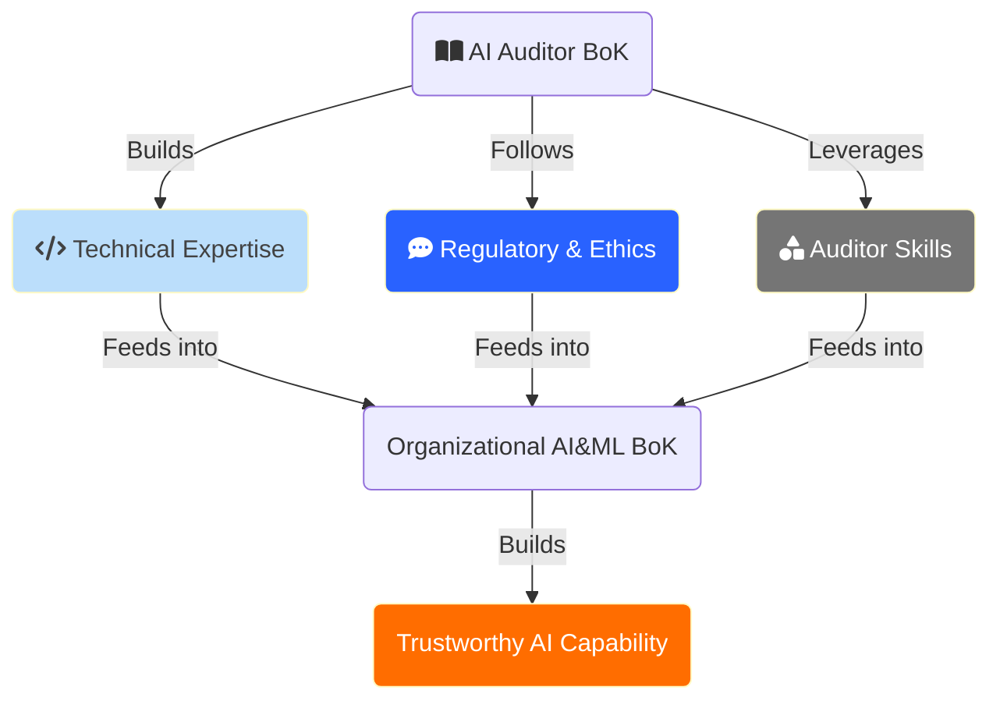

# Towards a Trustworthy AI Program

This repository outlines a comprehensive program for setting up an in-house Trustworthy AI initiative or capability group. It spans areas beyond technology itself, including ethics, law, social sciences, and philosophy. The goal is to build a Body of Knowledge (BoK) for AI auditors within organizations.

Disclaimer

__Although I harbour encyclopedical ambitions, this tsundoku-ish repo can only be a work in progress, part learning journey, part intellectual pursuit, and does not intend to be a final one stop shop.__

The ultimate goal is to build a BoK for a team of AI Auditors inside an organization, according to the definition of [Body of Knowledge](https://en.wikipedia.org/wiki/Body_of_knowledge) offered by Wikipedia.

__No affiliation links whatsoever__.

 

---

## Status and review cadence

| | |
|---|---|
| **Last full review** | February 2026 |
| **Next review due** | See [UPGRADE-PLAN.md](UPGRADE-PLAN.md) |
| **Fastest-moving sections** | Agentic safety, frontier model evaluations, regulation |

A body of knowledge in a field this fast has a half-life, and pretending otherwise is worse than admitting it. The table above is the honest signal: material outside the fast-moving sections ages slowly and most of it is still current, but anything touching agentic safety, frontier evaluations or regulatory timelines should be checked against a primary source before you rely on it.

[UPGRADE-PLAN.md](UPGRADE-PLAN.md) tracks what is known to need revision and why. If you spot something out of date, an issue is more useful than a polite silence.

## The lab

[`tai-lab/`](tai-lab/) is the practical companion: a FastAPI backend and a Next.js frontend that let you run evaluations against this material instead of only reading it. BYOK, deployable to Hugging Face Spaces and Vercel via the workflows in `.github/`.

---

## Table of Contents

### [1. Foundations](#1-foundations)
  - [What is Trustworthy AI](#what-is-trustworthy-ai)
  - [Core Principles](#core-principles)
  - [AI/ML Fundamentals](#aiml-fundamentals)

### [2. AI Development Lifecycle](#2-ai-development-lifecycle)
  - [Problem Scoping & Data](#problem-scoping--data)
    - [Data Quality & Governance](#data-quality--governance)
    - [Labeling & Augmentation](#labeling--augmentation)
    - [Synthetic Data](#synthetic-data)
  - [Model Training & Alignment](#model-training--alignment)
    - [Training Techniques](#training-techniques)
    - [RLHF & Human Feedback Methods](#rlhf--human-feedback-methods)
    - [Model Evaluation & Validation](#model-evaluation--validation)
  - [Deployment & Monitoring](#deployment--monitoring)

### [3. Trustworthiness Dimensions](#3-trustworthiness-dimensions)
  - [Transparency & Explainability](#transparency--explainability)
  - [Fairness & Bias](#fairness--bias)
  - [Privacy & Security](#privacy--security)
    - [Differential Privacy](#differential-privacy)
    - [Adversarial Attacks & Defenses](#adversarial-attacks--defenses)
    - [MLSecOps](#mlsecops)
  - [Robustness & Reliability](#robustness--reliability)
  - [Safety & Alignment](#safety--alignment)
    - [Agentic AI Safety](#agentic-ai-safety)
    - [Frontier Model Evaluations](#frontier-model-evaluations)

### [4. Governance & Regulation](#4-governance--regulation)
  - [Legal Frameworks](#legal-frameworks)
  - [Organizational Governance](#organizational-governance)
  - [Ethics Frameworks](#ethics-frameworks)
  - [Sustainability & Environmental Impact](#sustainability--environmental-impact)

### [5. Auditing & Assessment](#5-auditing--assessment)
  - [Systematic Auditing of AI Models](#systematic-auditing-of-ai-models)
  - [Audit Process & Methodology](#audit-process--methodology)
  - [Tools & Techniques](#tools--techniques)
  - [Documentation Standards](#documentation-standards)
  - [Specialized Auditing Skills](#specialized-auditing-skills)
  - [Soft Skills for AI Auditors](#soft-skills-for-ai-auditors)

### [6. Resources](#6-resources)
  - [Code Examples](#code-examples)
  - [Tools, Templates & Checklists](#tools-templates--checklists)
  - [Commercial Auditing Tools](#commercial-auditing-tools)
  - [Training & Certifications](#training--certifications)
  - [Books & Papers](#books--papers)
  - [Vendor Resources](#vendor-resources)

 

---

# 1. Foundations

## What is Trustworthy AI

[Detailed exploration of the concept](./pages/trustworthy_ai.md)

The topic of Trustworthy AI has garnered significant attention due to the rapid development and deployment of AI technologies. This interest is driven by the need to ensure that AI systems are safe, fair, explainable, and accountable.

Six crucial dimensions in achieving trustworthy AI:
- Safety & Robustness
- Nondiscrimination & Fairness
- Explainability
- Privacy
- Accountability & Auditability
- Environmental Well-being

Key references:
- [EU HLEG AI Guidelines](https://digital-strategy.ec.europa.eu/en/library/ethics-guidelines-trustworthy-ai)
- [China CAICT White Paper on TAI](http://www.caict.ac.cn/english/research/whitepapers/202110/P020211014399666967457.pdf)
- [Trustworthy AI: A Computational Perspective](https://arxiv.org/pdf/2107.06641)

## Core Principles

[Detailed principles page](./pages/principles.md)

The five foundational ethical principles for AI:
1. **Beneficence** - AI should be designed to benefit humanity
2. **Non-maleficence** - AI should not cause harm
3. **Autonomy** - AI should respect human agency and decision-making
4. **Justice** - AI should be fair and non-discriminatory
5. **Explicability** - AI decisions should be explainable and transparent

## AI/ML Fundamentals

Get more than a passing familiarity with the underlying technology and main paradigms.

- **Introduction to AI and ML**
  - [Basic concepts and terminology](https://medium.com/nlplanet/the-basic-concepts-and-terms-you-need-to-know-for-ai-and-ml-28eb07fd6c49)

- **Types of ML and AI systems**
  - Supervised, Unsupervised, Semi-supervised, and Reinforcement Learning
  - Self-supervised, Online, [Transfer Learning](https://aws.amazon.com/what-is/transfer-learning/)
  - [Basic Algorithms](https://www.tableau.com/data-insights/ai/algorithms)
  - How AI, ML and Deep Learning are [related](./pages/ai_overview.md)

- **Neural Networks**
  - [FNN, RNN, CNN, LSTM](./pages/neural_networks_overview.md)
  - [Transformer Architecture](https://arxiv.org/abs/1706.03762)
  - [Backpropagation](https://cklixx.people.wm.edu/teaching/math400/Annette-paper.pdf)

- **Machine Learning Algorithms**
  - [Coursera Overview](https://www.coursera.org/articles/machine-learning-algorithms)
  - [Comprehensive Tour](https://machinelearningmastery.com/a-tour-of-machine-learning-algorithms/)
  - [Wikipedia Category](https://en.wikipedia.org/wiki/Category:Machine_learning_algorithms)

 

---

# 2. AI Development Lifecycle

[Detailed lifecycle page](./pages/aiml_dev_lifecycle.md)

Understanding all stages of the AI & ML Development Lifecycle is critical for auditors. The lifecycle can be thought of in 4 phases:

1. **Phase 1**: Before ML - check if non-ML solutions can solve the problem
2. **Phase 2**: Simple ML models (logistic regression, gradient-boosted trees, k-NN)
3. **Phase 3**: Optimizing simple models (hyperparameter search, feature engineering, ensembles)
4. **Phase 4**: Complex models if simpler approaches don't meet requirements

## Problem Scoping & Data

### Data Quality & Governance

[Dedicated page on data quality](./pages/data_qa.md)

Key aspects to evaluate:
- **Data quality** - accuracy, completeness, consistency
- **Relevance** - alignment with problem scope
- **Contextual appropriateness** - time, location, scenario representation
- **Bias and variety** - representation across groups
- **Provenance** - sourcing, documentation, trustworthiness
- [Evaluating Data Quality](https://arxiv.org/abs/2303.01998)
- [A 2024 Survey of ETL tools](https://arxiv.org/pdf/2406.08335)

### Labeling & Augmentation

[Dedicated page](./pages/label_aug.md)

- Data cleaning, processing, improvement
- [Treatment of outliers](https://www.neuraldesigner.com/blog/effective-outlier-treatment-methods-machine-learning/)
- [Normalization and scaling](https://www.geeksforgeeks.org/normalization-and-scaling/)

### Synthetic Data

[Dedicated page](./pages/synth_data.md)

Synthetic data is [evolving fast](https://www.researchgate.net/publication/383910617_Advancements_in_Synthetic_Data_Generation_A_Comprehensive_Exploration_of_Generative_Models_Privacy-Preserving_Techniques_and_Real-World_Applications_Across_Industries) with [interesting use cases](https://www.researchgate.net/publication/357007527_Synthetic_data_use_exploring_use_cases_to_optimise_data_utility).

**Opportunities:**
- Addressing data deficits and representation concerns
- Privacy protection and bias reduction
- Economic efficiency vs real-world data collection
- Compliance requirements

**Risks:**
- Data quality issues leading to unreliable models
- Reverse engineering risks (hence [differential privacy](./pages/diff_priv.md))
- [Data pollution/contamination](https://arxiv.org/abs/2405.09597)
- [Model collapse from synthetic data](https://arxiv.org/abs/2307.01850)
- Bias propagation

References:
- [Opportunities and Risks of Synthetic Data](https://arxiv.org/pdf/2309.00652)
- [How to Validate Synthetic Data Quality](https://towardsdatascience.com/how-to-validate-the-quality-of-your-synthetic-data-34503eba6da)
- [Ethical Challenges of Using Synthetic Data](https://ojs.aaai.org/index.php/AAAI-SS/article/download/27490/27263/31541)

## Model Training & Alignment

### Training Techniques

- **Model Selection** - choosing appropriate algorithms based on problem nature
- **[Hyperparameter Tuning](https://arxiv.org/abs/2003.05689)** - grid search, random search, Bayesian optimization
- **[Cross-Validation](./pages/cross_valid.md)** - evaluating model generalization
- **[Performance Metrics](https://neptune.ai/blog/performance-metrics-in-machine-learning-complete-guide)**

### RLHF & Human Feedback Methods

[Dedicated RLHF page](./pages/rlhf.md)

Reinforcement Learning from Human Feedback incorporates human input to enhance AI model training. Key approaches:
- Binary/Scalar Feedback
- Comparative RLHF
- Proximal Policy Optimization (PPO)
- Direct Preference Optimization (DPO)
- Constitutional AI
- RLAIF (AI Feedback)

### Model Evaluation & Validation

- [Metrics to evaluate ML algorithms](https://towardsdatascience.com/metrics-to-evaluate-your-machine-learning-algorithm-f10ba6e38234)
- [Accuracy of training data and model outputs in Generative AI](https://arxiv.org/pdf/2407.13072)
- [Reliability in Machine Learning](https://www.researchgate.net/publication/380151336_Reliability_in_Machine_Learning)

## Deployment & Monitoring

An undeployed model is worthless, and an unmonitored one is a risk.

Key concerns:
- **[Conceptual drift](https://reunir.unir.net/bitstream/handle/123456789/14409/a_survey_on_machine_learning.pdf)** - data distribution shifts over time
- **[Quality drift](https://www.researchgate.net/publication/373610141_Explainable_Artificial_Intelligence-Based_Model_Drift_Detection_Applicable_to_Unsupervised_Environments)** - production data differs from training data
- **Infrastructure monitoring** - SLAs, failures, latencies, scalability

References:
- [Monitoring Checklist: 7 Things to Track](https://towardsdatascience.com/a-machine-learning-model-monitoring-checklist-7-things-to-track-2042be98a7b5)
- [Checklist for AI Deployment](https://www.usaid.gov/sites/default/files/2023-07/Artificial%20Intelligence%20Ethics%20Checklist.pdf)
- [Deployment and Monitoring Overview](https://configr.medium.com/ai-model-deployment-and-monitoring-f458a8a8c725)

 

---

# 3. Trustworthiness Dimensions

## Transparency & Explainability

[Dedicated transparency page](./pages/transparency.md) | [Algorithmic transparency page](./pages/algo_trans.md)

Techniques to make AI models interpretable and decisions understandable:

- **Explainable AI (XAI)**
  - [XAI: What we know and what is left to attain Trustworthy AI](https://www.sciencedirect.com/science/article/pii/S1566253523001148)
  - [XAI 2.0 paper](https://arxiv.org/abs/2310.19775)
  - [A Survey Of Methods For Explaining Black Box Models](https://arxiv.org/abs/1802.01933)

- **Interpretation Methods**
  - SHAP - [original paper](https://arxiv.org/pdf/1705.07874) | [documentation](https://shap.readthedocs.io/en/latest/)
  - LIME - [paper](https://arxiv.org/abs/1602.04938) | [code](https://github.com/marcotcr/lime)
  - [Explaining Explanations: An Overview of Interpretability](https://arxiv.org/pdf/1806.00069)

- **Algorithmic Transparency** - [EU Framework](https://algorithmic-transparency.ec.europa.eu/index_en), [UK Standard](https://www.gov.uk/government/collections/algorithmic-transparency-recording-standard-hub)

- **[Platform Observability](https://ojs.weizenbaum-institut.de/index.php/wjds/article/view/4_2_3)** - beyond algorithmic transparency to sociotechnical observability

## Fairness & Bias

[Dedicated bias page](./pages/bias.md) | [Types of AI bias](./pages/types_ai_bias.md)

- **Fairness Principles**
  - [The Fairness and ML Book](https://fairmlbook.org/)
  - [A Survey on Bias and Fairness in Machine Learning](https://arxiv.org/abs/1908.09635)

- **Bias Detection and Mitigation**
  - [Managing bias and unfairness in data](https://link.springer.com/article/10.1007/s00778-021-00671-8)
  - [Investigating Bias with a Synthetic Data Generator](https://arxiv.org/abs/2209.05889)
  - [NIST: Identifying and Managing Bias in AI](https://nvlpubs.nist.gov/nistpubs/SpecialPublications/NIST.SP.1270.pdf)
  - [De-biasing "bias" measurement](https://arxiv.org/abs/2205.05770)
  - [Mitigating bias in artificial intelligence](https://www.sciencedirect.com/science/article/pii/S0167739X24000694)

## Privacy & Security

### Differential Privacy

[Dedicated page](./pages/diff_priv.md)

- [OpenDP Framework](https://docs.opendp.org/en/stable/index.html)
- [differentialprivacy.org](https://differentialprivacy.org/)
- [A friendly, non-technical introduction](https://desfontain.es/blog/friendly-intro-to-differential-privacy.html)
- [TensorFlow Privacy library](https://github.com/tensorflow/privacy)
- [Opacus library](https://opacus.ai/) for PyTorch

### Adversarial Attacks & Defenses

[Dedicated attacks page](./pages/attacks.md)

- **Threat Modeling**
  - [MLSecOps](https://mlsecops.com/)
  - [Microsoft: Threat Modeling AI/ML Systems](https://learn.microsoft.com/en-us/security/engineering/threat-modeling-aiml)
  - [MITRE ATLAS](https://atlas.mitre.org/)
  - [Google's SAIF](https://blog.google/technology/safety-security/introducing-googles-secure-ai-framework/)

- **Attack Types** - Evasion, Poisoning, Model Extraction, Membership Inference, Prompt Injection, Jailbreaking, and [more](./pages/attacks.md)

- **Defense Strategies**
  - [NIST Adversarial ML Taxonomy](https://nvlpubs.nist.gov/nistpubs/ai/NIST.AI.100-2e2023.pdf)
  - [Adversarial Attacks and Defenses in Deep Learning](https://www.sciencedirect.com/science/article/pii/S209580991930503X)
  - [OWASP ML Security Top Ten](https://owasp.org/www-project-machine-learning-security-top-10/)

### MLSecOps

[Dedicated page](./pages/mlsecops.md)

- **Secure AI Development**
  - [NIST Secure Software Development for GenAI](https://nvlpubs.nist.gov/nistpubs/SpecialPublications/NIST.SP.800-218A.pdf)
  - [UK Guidelines for Secure AI System Development](https://www.ncsc.gov.uk/files/Guidelines-for-secure-AI-system-development.pdf)

- **Data Pipeline Security**
  - [Securing the AI Pipeline](https://cloud.google.com/blog/topics/threat-intelligence/securing-ai-pipeline/)
  - [Anonymization techniques](https://www.privacydynamics.io/post/data-anonymization-in-ai-a-path-towards-ethical-machine-learning/)

## Robustness & Reliability

- [AI Maintenance: A Robustness Perspective](https://arxiv.org/pdf/2301.03052)
- **Model Performance Evaluation** - precision, recall, F1-score, AUC-ROC, [cross-validation techniques](https://www.markovml.com/blog/model-evaluation-metrics)
- **Error Analysis** - [Confusion Matrix](https://en.wikipedia.org/wiki/Confusion_matrix), [Feature Importance](https://www.aporia.com/learn/feature-importance/feature-importance-7-methods-and-a-quick-tutorial/), Error Patterns
- **[Debugging ML Models](https://www.markovml.com/blog/ml-model-debugging)** - [book](https://www.amazon.es/Debugging-Machine-Learning-Models-Python/dp/1800208588)

## Safety & Alignment

### AI Safety Fundamentals

- **AI Alignment** - making AI systems do what humans want without unintended side effects
- **Risk Assessment** - identifying and mitigating AI risks
- **Fail-safe Mechanisms** - graceful degradation strategies
- **GenAI Safety** - [NIST GenAI Risk Management Profile](https://nvlpubs.nist.gov/nistpubs/ai/NIST.AI.600-1.pdf)
- **Long-term Safety** - AGI considerations ([Roman V. Yampolskiy's work](https://scholar.google.com/citations?user=0_Rq68cAAAAJ&hl=en))

### Agentic AI Safety

[Dedicated page](./pages/agentic_safety.md)

As AI systems become more autonomous, new safety considerations emerge:
- Agent autonomy and oversight
- Tool use and function calling risks
- Multi-agent coordination
- Sandboxing and containment
- Human-in-the-loop requirements

### Frontier Model Evaluations

Evaluating capabilities and risks of frontier AI models:
- **Capability Evaluations** - dangerous capability assessments
- **Uplift Studies** - measuring capability gains from AI assistance
- **Automated Red Teaming** - AI testing AI
- **Pre-deployment Testing** - safety assessments before release

### Red Teaming

[Red teaming overview](https://arxiv.org/abs/2404.00629)

AI/ML Red Teaming identifies vulnerabilities and weaknesses before exploitation:
- [Red Teaming Language Models with Language Models](https://arxiv.org/abs/2202.03286)
- [Learning diverse attacks on LLMs](https://arxiv.org/abs/2405.18540)
- [Red Teaming LLMs: Methods, Scaling, Lessons](https://arxiv.org/abs/2209.07858)
- [SocioTechnical Approach to Red Teaming](https://arxiv.org/abs/2406.11757)

**Vendor Tools:**
- [Microsoft PyRIT Framework](https://github.com/Azure/PyRIT)
- [Google AI Red Team](https://blog.google/technology/safety-security/googles-ai-red-team-the-ethical-hackers-making-ai-safer/)

 

---

# 4. Governance & Regulation

## Legal Frameworks

- **[EU AI Act](https://www.europarl.europa.eu/topics/en/article/20230601STO93804/eu-ai-act-first-regulation-on-artificial-intelligence)** - risk-based categorization with corresponding requirements
- **[NIST AI Risk Management Framework](https://www.nist.gov/itl/ai-risk-management-framework)** - [standard PDF](https://nvlpubs.nist.gov/nistpubs/ai/NIST.AI.600-1.pdf)
- **[GDPR](https://eur-lex.europa.eu/legal-content/EN/TXT/PDF/?uri=CELEX:32016R0679)** and **[CCPA](https://cppa.ca.gov/regulations/pdf/cppa_act.pdf)** for data protection
- **[OECD AI Principles](https://oecd.ai/en/ai-principles)**

**Sector-Specific Regulations:**
- [FINRA AI/ML Guidelines](https://www.finra.org/rules-guidance/key-topics/fintech/report/artificial-intelligence-in-the-securities-industry/ai-apps-in-the-industry) (Financial)
- [EEOC AI in Hiring](https://www.eeoc.gov/laws/guidance/americans-disabilities-act-and-use-software-algorithms-and-artificial-intelligence) (HR)
- Healthcare AI regulations

[More on legal aspects](./pages/lawler.md)

## Organizational Governance

- **AI Policies** - organizational AI usage policies
- **Accountability structures** - roles and responsibilities
- **[AIGA Framework](https://ai-governance.eu/ai-governance-framework/the-ai-governance-lifecycle/)**
- **[Defining Organizational AI Governance](https://link.springer.com/content/pdf/10.1007/s43681-022-00143-x.pdf)**
- **[Toward AI Governance Best Practices](https://link.springer.com/article/10.1007/s10796-022-10251-y)**
- **[Putting AI Ethics into Practice: The Hourglass Model](https://arxiv.org/abs/2206.00335)**

## Ethics Frameworks

- **[OECD AI Policy Observatory](https://oecd.ai/en/)**
- **[EU AI HLEG](https://digital-strategy.ec.europa.eu/en/policies/expert-group-ai)**
- **[IEEE Ethically Aligned Design](https://standards.ieee.org/wp-content/uploads/import/documents/other/ead_v2.pdf)**
- **[IEEE 7000-2021 Standard](https://www.aditicorp.com/wp-content/uploads/2024/09/7000-2021.pdf)** - Addressing Ethical Concerns in System Design

**ISO Standards:**
- [ISO/IEC 42001:2023](https://www.iso.org/standard/81230.html) - AI Management System
- [ISO/IEC 23894:2023](https://www.iso.org/standard/77304.html) - AI Risk Management
- [ISO/IEC TR 24027:2021](https://www.iso.org/standard/77607.html) - Bias in AI Systems
- [ISO/IEC TS 12791](https://www.iso.org/standard/84110.html) - Treatment of Unwanted Bias
- [ISO/IEC DIS 42006](https://www.iso.org/standard/44546.html) - Requirements for AI Audit Bodies (forthcoming)

## Sustainability & Environmental Impact

[Dedicated page](./pages/sustain.md)

Key topics:
- Understanding sustainability concerns around AI/ML models
- Tools and techniques to measure environmental impact
- Carbon footprint of training and inference
- Green AI practices

 

---

# 5. Auditing & Assessment

## Systematic Auditing of AI Models

[Challenges page](./pages/challenges.md)

Comprehensive auditing frameworks must:
- Consider multiple dimensions: governance, strategy, performance, monitoring, review
- Cover both technical aspects and ethical considerations
- Adhere to evolving standards (ISO/IEC 42001:2023, EU AI Act, etc.)
- Evaluate monitoring metrics and remediation procedures
- Include the entire AI lifecycle
- Account for stakeholder interests and ethical metrics

**Key Challenges:**
- Absence of standardized frameworks
- Rapidly evolving field requiring continuous learning
- AI system complexity and black-box nature
- Different regulatory requirements across jurisdictions
- Skills gap in the industry
- Difficulty validating massive training datasets

**References:**
- [ISACA Auditing AI Report](https://ec.europa.eu/futurium/en/system/files/ged/auditing-artificial-intelligence.pdf)
- [Towards Auditable AI Systems](https://www.hhi.fraunhofer.de/fileadmin/Departments/AI/TechnologiesAndSolutions/AuditingAndCertificationOfAiSystems/2022-05-23-whitepaper-tuev-bsi-hhi-towards-auditable-ai-systems.pdf)
- [Auditing LLMs: A Three-Layered Approach](https://cdn.governance.ai/Auditing_LLMs_A_Three%E2%80%90Layered_Approach.pdf)

## Audit Process & Methodology

[Detailed process page](./pages/process.md)

### AI Assurance

[Dedicated assurance page](./pages/assurance.md)

AI assurance provides confidence that an AI system is designed, developed, and deployed responsibly. Key aspects:
- Independent evaluation
- Criteria-based assessment
- Transparency
- Accountability

### Audit Planning and Scoping

- Defining audit objectives and scope
- Developing audit criteria and checklists
- Risk identification and assessment
  - [Identifying Security Risks of GenAI](https://www.researchgate.net/publication/373487947_Identifying_and_Mitigating_the_Security_Risks_of_Generative_AI)
  - [Berkeley AI Risk Assessment Guidance](https://cltc.berkeley.edu/wp-content/uploads/2021/08/AI_Risk_Impact_Assessments.pdf)
  - [Bias Risk Template](https://ai.bsa.org/wp-content/uploads/2021/06/2021bsaaibiasframework.pdf)

### Audit Execution Techniques

- **Data sampling and analysis** - examining training and test data for bias, quality, representativeness
- **Data lineage and provenance** - integrity verification
- **Model evaluation and testing** - LIME, SHAP, adversarial testing, stress testing
- **Source code and architecture review** - security vulnerabilities

## Tools & Techniques

[Evidence gathering techniques](./pages/evidence_gather.md)

- [The Right Tool for the Job: Open-Source Auditing Tools in ML](https://arxiv.org/abs/2206.10613)
- Hands-on experience with selected tools

## Documentation Standards

- **Model Cards** - [HuggingFace guide](https://huggingface.co/blog/model-cards), [landscape analysis](https://huggingface.co/docs/hub/model-card-landscape-analysis)
- **Datasheets** - [Datasheets for Datasets](https://www.fatml.org/media/documents/datasheets_for_datasets.pdf)
- **[Data Statements Guide for NLP](https://techpolicylab.uw.edu/wp-content/uploads/2021/11/Data_Statements_Guide_V2.pdf)**
- **[Data Cards Playbook](https://github.com/PAIR-code/datacardsplaybook/)**
- **[Version Control for AI Models](https://neptune.ai/blog/version-control-for-ml-models)**
- **[Audit of Dataset Licensing](https://www.nature.com/articles/s42256-024-00878-8)**

## Specialized Auditing Skills

### AI Performance Metrics

- [Metrics for measuring AI progress](https://arxiv.org/pdf/2008.02577)
- [Principles for Evaluation of AI/ML Performance](https://arxiv.org/pdf/2107.02868)
- [Measuring AI Beyond Accuracy](https://arxiv.org/pdf/2204.04211)
- [Loss Functions and Metrics in Deep Learning](https://arxiv.org/abs/2307.02694)
- [Benchmarking and Comparative Analysis](https://mlsysbook.ai/contents/benchmarking/benchmarking.html)
- [Monitoring AI Systems](https://arxiv.org/abs/2205.02562)

### Programming for AI Auditing

- Basic Python for data analysis and model inspection
- Libraries: [AI Fairness 360](https://aif360.res.ibm.com/), SHAP, LIME
- Understanding different roles: data scientist, [AI product owner](https://www.datascience-pm.com/ai-product-owner/)

## Soft Skills for AI Auditors

### Critical & Ethical Decision Making

AI ethics literature has converged on 5 core principles: **transparency, justice and fairness, non-maleficence, responsibility, and privacy**.

- Ability to critically evaluate AI-generated outputs
- Healthy skepticism towards AI insights
- Navigating ethical dilemmas in auditing

**References:**
- [The Ethics of AI Business Practices](https://papers.ssrn.com/sol3/papers.cfm?abstract_id=4034804)
- [An Overview of Artificial Intelligence Ethics](https://www.researchgate.net/publication/362334936_An_Overview_of_Artificial_Intelligence_Ethics)
- [Ethics-Based Auditing to Develop Trustworthy AI](https://www.semanticscholar.org/reader/7ca51263bb2de8a03ed661d19b59c99dc9e1cbb1)
- [The Ethics of AI Ethics: An Evaluation of Guidelines](https://link.springer.com/article/10.1007/s11023-020-09517-8)

### Communication and Stakeholder Management

- Explaining technical concepts to non-technical audiences
- Communicating with stakeholders of varying AI literacy
- Negotiation and conflict resolution in audit scenarios
- Sector-specific knowledge

 

---

# 6. Resources

## Code Examples

Practical Python implementations of key Trustworthy AI techniques are available in the [code/](./code/) folder:

| Topic | File | Libraries |
|-------|------|-----------|
| Bias Testing | [bias_testing.py](./code/bias_testing.py) | AIF360, Fairlearn |
| Explainability | [explainability.py](./code/explainability.py) | SHAP, LIME |
| Adversarial Testing | [adversarial_testing.py](./code/adversarial_testing.py) | ART, PyRIT |
| Evaluation Frameworks | [eval_frameworks.py](./code/eval_frameworks.py) | Inspect AI, Custom |
| Differential Privacy | [differential_privacy.py](./code/differential_privacy.py) | Opacus, TensorFlow Privacy |

Each file contains verbose explanations of the underlying concepts, practical runnable examples, and best practices for production use.

## Tools, Templates & Checklists

- [Self-Assessment list for Trustworthy AI (ALTAI)](https://ec.europa.eu/newsroom/dae/document.cfm?doc_id=68342)
- [Microsoft Responsible AI Standard v2](https://query.prod.cms.rt.microsoft.com/cms/api/am/binary/RE4ZPmV)
- [Data Ethics Canvas](https://theodi.org/news-and-events/blog/data-ethics-canvas/)
- [AI Ethics Policy Template](https://www.aiguardianapp.com/ai-ethics-policy-template)
- [AI Ethics Toolkit](https://www.hum-dseg.org/ai-applied-ethics-toolkit)
- [NOREA Guiding Principles](https://www.norea.nl/uploads/bfile/a344c98a-e334-4cf8-87c4-1b45da3d9bc1)
- [UK ICO AI Audit Guide](https://ico.org.uk/media/for-organisations/documents/4022651/a-guide-to-ai-audits.pdf)
- [AI Incident Database](https://incidentdatabase.ai/)
- [TrustLLM Toolkit](https://github.com/HowieHwong/TrustLLM)
- [AuditNLG (Salesforce)](https://github.com/salesforce/AuditNLG)
- [HRIA Guidance and Template](https://www.humanrights.dk/files/media/document/A%20HRIA%20of%20Digital%20Activities%20-%20Introduction_ENG_accessible.pdf)
- [EDPB AI Auditing Checklist](https://www.edpb.europa.eu/system/files/2024-06/ai-auditing_checklist-for-ai-auditing-scores_edpb-spe-programme_en.pdf)
- [NIST AI RMF](https://nvlpubs.nist.gov/nistpubs/ai/nist.ai.100-1.pdf)
- [Microsoft PyRIT](https://github.com/Azure/PyRIT)
- [Model Cards and Datasheets Collection](https://github.com/ivylee/model-cards-and-datasheets)
- [EU Aequitas Project](https://www.aequitas-project.eu/)
- [SEI MLTE](https://github.com/mlte-team/mlte)
- [LatticeFlow AI Assessments](https://latticeflow.ai/solutions/ai-assessments/)

## Commercial Auditing Tools

- [AI Auditing Tools: Best 6 Solutions](https://hyscaler.com/insights/ai-auditing-tools-empower-6-ways/)
- [Popular Software Tools for AI Auditability](https://www.fairo.ai/blog/popular-ai-tools)
- [Top 25 AI Governance Tools](https://research.aimultiple.com/ai-governance-tools/)
- [LAMARR: AI for Auditing](https://lamarr-institute.org/blog/ali-ai-for-auditing/)
- [Fiddler Auditor](https://www.fiddler.ai/blog/introducing-fiddler-auditor-evaluate-the-robustness-of-llms-and-nlp-models)
- [AI Security Tools: Open-Source Toolkit](https://www.wiz.io/academy/ai-security-tools)
- [ISACA Policy Template Library](https://store.isaca.org/s/store#/store/browse/detail/a2S4w000008L3V9EAK)

## Training & Certifications

**Training:**
- [ISACA AI Resources](https://www.isaca.org/resources/artificial-intelligence)
- [IIA Auditing AI Course](https://www.theiia.org/en/products/learning-solutions/course/auditing-artificial-intelligence-ai-a-hands-on-course-for-internal-auditors/)
- [IIA Essentials for AI Auditing](https://www.theiia.org/en/products/learning-solutions/course/internal-auditing-in-the-age-of-artificial-intelligence/)
- [Babl AI Courses](https://babl.ai/courses/)
- [Coursera Responsible GenAI](https://www.coursera.org/specializations/responsible-generative-ai)
- [MIT AI Strategy and Leadership](https://executive-ed.xpro.mit.edu/ai-strategy-and-leadership)

**Certifications:**
- [IAPP AIGP](https://iapp.org/certify/aigp/)
- [ISO/IEC 42001 Lead Auditor](https://pecb.com/en/education-and-certification-for-individuals/iso-iec-42001/iso-iec-42001-lead-auditor)
- [UL Certified AI Professional](https://www.ul.com/sis/training/ul-certified-artificial-intelligence-professional)
- [EITCA AI Academy](https://eitca.org/eitca-ai-artificial-intelligence-academy/)
- [ForHumanity Certifications](https://forhumanity.center/certifications/)

## Books & Papers

- [Trustworthy AI Papers Collection](https://github.com/nuaa-nlp/TrustworthyAIPapers)
- [Debugging ML Models with Python](https://github.com/PacktPublishing/Debugging-Machine-Learning-Models-with-Python)
- [Towards a Business Case for AI Ethics](https://jyx.jyu.fi/bitstream/handle/123456789/93508/agbeseym.pdf)
- [Responsible AI and ESG](https://www.csiro.au/-/media/D61/Responsible-AI/Alphinity/Responsible-AI-and-ESG.pdf)
- [CEPS AI Ethics Task Force Report](https://cdn.ceps.eu/wp-content/uploads/2019/02/AI_TFR.pdf)
- [2024 AI Assurance Technology Market Report](https://drive.google.com/file/d/1VcAdwn46qVfc2j-6ls0JXoVwHwuH4YSY/view)
- [Code & Conduct: Third Party AI Auditing](https://www.hkdca.com/wp-content/uploads/2024/06/code-and-conduct-ada-lovelace.pdf)
- [Practicing Trustworthy ML (O'Reilly)](https://learning.oreilly.com/library/view/practicing-trustworthy-machine/9781098120269/)
- [A Blueprint for Auditing Generative AI](https://www.researchgate.net/publication/382080223_A_Blueprint_for_Auditing_Generative_AI)

## Vendor Resources

- [Azure: What is Responsible AI?](https://learn.microsoft.com/en-us/azure/machine-learning/concept-responsible-ai)
- [AWS GenAI Security](https://aws.amazon.com/ai/generative-ai/security/)
- [SGS: Trustworthiness of AI](https://www.sgs.com/en/whitepapers/trustworthiness-of-ai-form)
- [SGS: Trustworthy AI, Privacy and Security](https://www.sgs.com/en/whitepapers/trustworthy-ai-privacy-and-security-in-ai-form)
