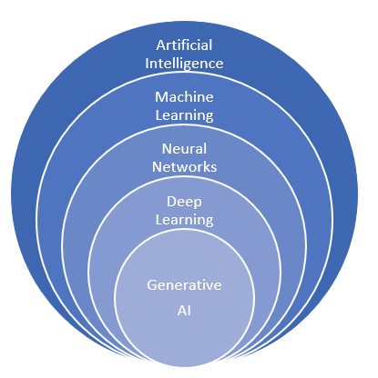

# How AI, ML and Deep Learning are related

This image will help us understand the existing hierarchy. Above all, it is advisable not to confuse the extensive field of AI in general with generative AI, something common with the explosion of genAI, the popularization and democratization of these tools. As we have seen above in the previous slides, AI as an academic and research discipline is much more than generative AI. 

And within generative AI, a subset would be conversational AI. Generative AI works on the principles of machine learning, a branch of artificial intelligence that allows machines to learn from data. However, unlike traditional machine learning models that learn patterns and make predictions or decisions based on those patterns, generative AI takes it a step further — it not only learns from data, but also creates new instances of data that 

They imitate the properties of the input data. Broadly speaking, The cornerstone of generative AI is deep learning, a type of machine learning that imitates the functioning of the human brain in processing data and creating patterns for decision making. Deep learning models use complex architectures known as artificial neural networks. Such networks comprise numerous interconnected layers that process and transfer information, mimicking neurons in the human brain.

Artificial Intelligence (AI), Machine Learning (ML), and Deep Learning (DP) are related but distinct concepts in the field of computer science and artificial intelligence.

**Artificial Intelligence (AI)**: AI is the broadest and most encompassing term, referring to the development of computer systems capable of performing tasks that typically require human intelligence. AI refers to the simulation of human intelligence in machines designed to think and act like humans. AI can encompass a wide range of technologies, including machine learning, natural language processing, computer vision, and robotics. As such, it has [a long history](https://en.wikipedia.org/wiki/History_of_artificial_intelligence).

**Machine Learning (ML)**: Machine learning is a type of AI that allows computers to learn from data without being explicitly programmed and make predictions or decisions based on data and the learning done. Machine learning algorithms use statistical models to analyze data and make predictions or decisions. 
Normally, ML:

- Can train on smaller datasets compared to deep learning
- Requires more human intervention to correct and learn
- Generally has shorter training times but lower accuracy compared to deep learning
- Makes simpler, often linear correlations in data

**Neural Networks**: a fundamental concept in artificial intelligence with a long history of research. Neural networks are a powerful subset of machine learning techniques inspired by the structure and function of the human brain. Neural networks consist of interconnected nodes (artificial neurons) organized in layers, capable of learning from data to perform tasks such as pattern recognition, classification, and prediction. They can be applied to a wide range of problems, from simple linear regressions to complex image and speech recognition tasks. Neural networks form the foundation for more advanced techniques like deep learning, which utilizes multiple hidden layers to model highly complex non-linear relationships in data. Their ability to automatically learn features and representations from raw data has made neural networks a cornerstone of modern machine learning, driving innovations in artificial intelligence across various domains including computer vision, natural language processing, and robotics.

**Deep Learning (DL)**: Deep learning is a subfield of machine learning that uses artificial neural networks with multiple layers to process and analyze large amounts of complex data. Deep learning algorithms are particularly well suited for tasks such as image and speech recognition, where they can automatically identify patterns and features in large amounts of data.

- Requires large amounts of data for training
- Can learn on its own from the environment and past mistakes
- Generally has longer training times but higher accuracy compared to traditional ML
- Makes non-linear, complex correlations in data
- Often requires specialized hardware (GPUs) for training

Deep learning is a specialized subset of neural networks characterized by networks with multiple hidden layers and increased complexity that allow for learning and representing more complex patterns in data.
