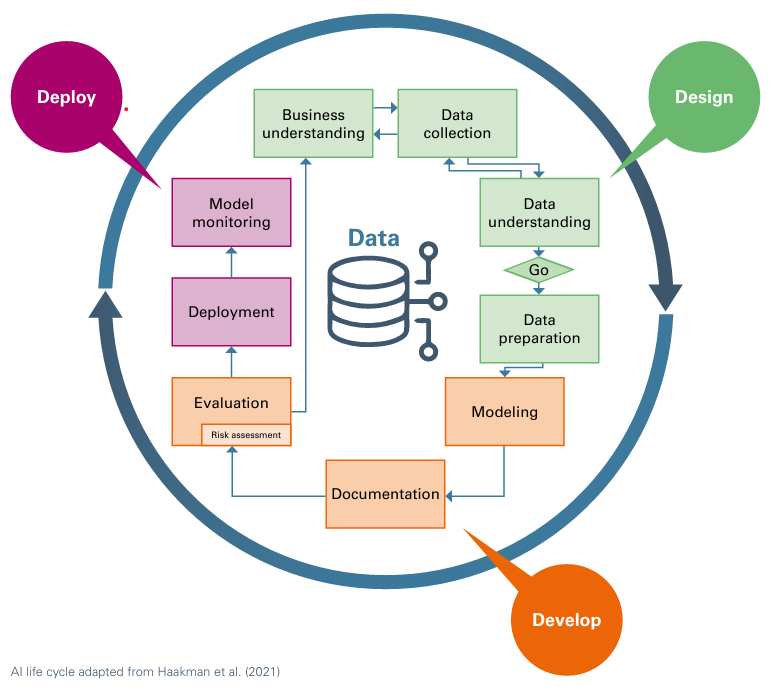

From the point of view of auditing an AI / ML models, the lifecycle begins identifying the business problem or goals and the thinking that led to framing those as an AI/ML problem.

Adapted from Haakman et al. (2021) [AI lifecycle models need to be revised](https://www.researchgate.net/publication/353128118_AI_lifecycle_models_need_to_be_revised)

## 1. Business Goal Identification and Problem Framing

Understand if 

- clear business objectives were defined
- the feasibility of using AI/ML was assessed
- success metrics (business KPIs and technical metrics) were clear and well-defined, as well as shared
- If and how a decision was made between AI (which may involve more complex, human-like decision making) or ML (which focuses on learning patterns from data). Both are subject to risks and biases.

## 2. Data Collection and Preparation

This stage involves gathering, cleaning, and preparing data for model development:
- Data collection from various sources
- Data cleaning and preprocessing
- Feature engineering and selection
- Data labeling (for supervised learning)
- Handling missing data and outliers
- Data augmentation (if necessary)

Examine, understand and get evidence of how these were stages were carried out.

**Links**

[A Survey on Data Collection for Machine Learning](https://arxiv.org/pdf/1811.03402)

## 3. Model Selection and Architecture Design
This phase involves choosing the appropriate model or algorithm:
- For ML: Selecting algorithms (e.g., decision trees, SVMs, neural networks)
- For AI: Designing more complex architectures (e.g., deep neural networks, transformer models)
- Considering model interpretability requirements
- Assessing computational resources and constraints

**Links**

[Neural Architecture Search: A Survey](https://jmlr.org/papers/volume20/18-598/18-598.pdf)

## 4. Model Training and Optimization

- This stage involves training the selected model on the prepared data:
  - Splitting data into training, validation, and test sets
  - Implementing the chosen algorithm or architecture
  - Training the model on the training data
  - [Hyperparameter tuning](https://arxiv.org/abs/1706.00764) (e.g., using grid search, random search, or Bayesian optimization)
  - Implementing regularization techniques to prevent overfitting

AI models often require more extensive training and may use techniques like transfer learning or few-shot learning. As an auditor you need to be familiar with those. 

## 5. Model Evaluation and Testing
This crucial phase involves assessing the model's performance:
- Evaluating on the test set
- Using appropriate metrics:
  - For classification: accuracy, precision, recall, F1-score, AUC-ROC
  - For regression: MSE, RMSE, MAE, R-squared
  - For ranking: NDCG, MAP
  - Conducting cross-validation
- Performing error analysis
- Assessing fairness and bias
- Conducting adversarial testing (especially important for AI systems)

**Links**

## 6. Model Interpretability and Explainability
This stage is particularly important for AI systems:

- Implementing [SHAP](https://arxiv.org/pdf/1705.07874) (SHapley Additive exPlanations) - SHAP is a model-agnostic tool for explaining the output of machine learning models. It assigns each feature in a prediction a contribution value, using concepts from cooperative game theory (specifically Shapley values). SHAP values show how much each feature positively or negatively influenced the prediction, providing transparency even in complex models like neural networks or ensemble methods. 
- Implementing [LIME](https://arxiv.org/abs/1602.04938) (Local Interpretable Model-agnostic Explanations) - a technique designed to explain individual predictions of any machine learning model, including complex "black box" models. It creates a simplified, interpretable local model that approximates the behavior of the complex model around a specific prediction. LIME perturbs the input data, observes the model's responses, and fits a simple model (like linear regression) to this local behavior. The result is a list of features and their importance in contributing to the specific prediction, often presented visually. This approach is model-agnostic, meaning it can be applied to any type of machine learning model, and it provides local explanations rather than global model interpretations. LIME is particularly valuable in fields where understanding the reasoning behind predictions is crucial, such as healthcare or finance, helping to build trust in model predictions and aiding in model debugging. However, it's important to note that while LIME offers insights into individual predictions, it may not capture the overall behavior of the model across all possible inputs.
- Generating [feature importance rankings](https://truera.com/ai-quality-education/explainability/how-to-interpret-and-use-feature-importance-in-ml-models/). Feature importance is often used for dimensionality reduction by assigning a score to different input features based on how useful those are at predicting a target variable. Feature importance may also be used for model inspection and communication.
- Creating partial dependence plots
- Developing user-friendly explanations of model decisions

**Links**

[A Survey Of Methods For Explaining Black Box Models](https://arxiv.org/abs/1802.01933)

## 7. Model Deployment
This phase involves integrating the model into production systems, often with more mundane tasks such as dockerization, apification, CI/CD pipelines, A/B testing strategies perhaps (or dark reads), scalability and efficiency. In some scenarios, edge deployments for AI systems that require low-latency inference (IoT).

**Links**

[Challenges in Deploying Machine Learning: A Survey of Case Studies](https://dl.acm.org/doi/full/10.1145/3533378)
[Hidden Technical Debt in Machine Learning Systems](https://papers.nips.cc/paper_files/paper/2015/file/86df7dcfd896fcaf2674f757a2463eba-Paper.pdf)

## 8. Monitoring and Maintenance

- Implementing logging and monitoring systems
- Tracking model performance metrics in production
- Monitoring for data drift and concept drift
- Setting up alerts for performance degradation
- Retraining models periodically or as needed
- Updating models to address emerging issues or incorporate new data

AI systems may require more sophisticated monitoring due to their complex nature and potential for unexpected behaviors, including hallucinations or drifting.

**Links**

[Monitoring machine learning models: a categorization of challenges and methods](https://www.sciencedirect.com/science/article/pii/S2666764922000303)

[Model Drift in ML](https://towardsdatascience.com/drift-in-machine-learning-e49df46803a)

## Conclusion

Throughout this lifecycle, it's crucial to consider ethical implications, ensure regulatory compliance, and maintain robust documentation. The process is often iterative, with feedback loops between stages allowing for continuous improvement.

AI systems generally require more extensive experimentation, have higher computational demands, and often need more sophisticated interpretability and monitoring approaches compared to traditional ML models. They may also involve more complex deployment scenarios, especially for edge AI applications.

By following this comprehensive lifecycle, organizations can develop robust, reliable, and effective AI/ML systems that provide tangible business value while managing associated risks and challenges.