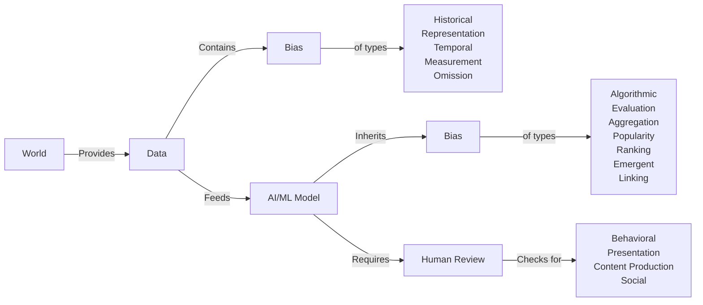

# Bias and Fairness testing

> **Code Examples**: See [bias_testing.py](../code/bias_testing.py) for practical implementations using AIF360 and Fairlearn libraries, including bias detection, measurement, and mitigation techniques.

## Overview of Bias and Fairness in ML

AI and machine learning models can exhibit various types of biases. Here's an explanation of the mentioned biases and some additional ones:

## Data-related Biases

**Historical Bias:** This occurs when the training data reflects past societal prejudices or inequalities (employment data, credit scoring, gender and social stereotypes etc). This can be simply a reflection of the state of the world at the time as reflected in the data, but as an auditor it is important to be aware of the possible presence of bias in the available data. 

- [Quantifying Bias and Uncertainty in Historical Data Collections with Probabilistic Programming](https://ceur-ws.org/Vol-2723/short46.pdf)

**Representation Bias:** This arises when certain groups or characteristics are underrepresented in the training data. An example is facial recognition systems trained primarily on light-skinned faces, leading to poor performance on darker skin tones. Similar to the previous type of bias, but the difference here is that this type of bias often results from flaws in the data collection or sampling process, whereas historical bias is present in data. 

In both cases, the use of synthetic data might be able to mitigate bias by:
  - rebalancing data representation
  - simulating fairness
  - generate additional samples for underrepresented populations
  - fill data gaps for data that is simply not there

This is not without its own set of challenges, as you could easily introduce new biases or ideological considerations, and even synthetic data could easily augment existing biases.

[This blog post](https://www.eckerson.com/articles/mitigating-the-risk-of-bias-in-synthetic-data-for-ai) explores the risk in using synthetic data for correcting bias present in data. 

**Temporal Bias:** Also related to historical bias, occurs when training data becomes outdated and doesn't reflect current realities. A classic example is cutoff date for training data.

**Measurement Bias:** This happens when the features or labels used in the model are inaccurate proxies for what we actually want to measure. 

**Omission Bias:** This occurs when important features or groups are left out of the training data, leading to skewed results.

## Algorithm-related Biases

**Algorithmic Bias:** This refers to systematic errors in the algorithm itself that lead to unfair outcomes. This can include, flaws in the algorithm design itself, inappropriate model selection, flawed [feature weighting](https://www.sciencedirect.com/science/article/abs/pii/S0957417421008423) or overfitting/underfitting.

**Evaluation Bias:** This happens when the benchmarks or metrics used to evaluate model performance are not representative or appropriate for all groups, i.e. overlooking unique characteristics of subpopulations or inappropriately generalizations. 

**Aggregation Bias:** This occurs when distinct populations in the data are inappropriately combined into a single model, ignoring important differences between groups.

**Popularity Bias:** In recommendation systems, this bias favors already popular items, making it harder for new or niche items to gain visibility.

**Ranking Bias:** This occurs in systems that present ordered lists of items, where higher-ranked items receive disproportionate attention. In a way, it is a manner of presentation bias as well. 

**Emergent Bias:** This develops over time as users interact with an AI system, potentially reinforcing existing biases.

**Linking Bias:** In network analysis, this bias can occur when connections between entities are not representative of real-world relationships.

- [(IBM) What is algorithmic bias?](https://www.ibm.com/think/topics/algorithmic-bias)

## User Interaction Biases

**Behavioral Bias:** This arises from how users interact with the system, potentially skewing the data or results.

**Presentation Bias:** This occurs when the way information is presented influences user behavior or decision-making.

**Content Production Bias:** This happens when the content created by users (which may be used to train models) is influenced by the system's design or existing biases.

**Social Bias:** This reflects and potentially amplifies existing societal prejudices and stereotypes.

## Additional Biases

**Sampling Bias:** This occurs when the data collection process doesn't ensure a representative sample of the population.

**Selection Bias:** This happens when the data used to train the model is chosen in a way that's not random or representative.

**Confirmation Bias:** This occurs when data is selectively included to confirm preexisting beliefs or hypotheses.

**Implicit Bias:** This reflects unconscious attitudes or stereotypes that can influence data collection or model design.

**Label Bias:** This happens when the outcome variable is differentially ascertained or has different meanings across groups.

 

- (Paper) [A Survey on Bias and Fairness in Machine Learning](http://arxiv.org/pdf/1908.09635.pdf)
- (Paper) [A Review of Bias and Fairness in Artificial Intelligence (pdf)](https://reunir.unir.net/bitstream/handle/123456789/15693/ip2023_11_001.pdf?isAllowed=y&sequence=1)
- (Paper) [Policy advice and best practices on bias and fairness in AI](https://nobias-project.eu/wp-content/uploads/2024/01/ETINcrc.pdf)
- (Paper) [Towards Algorithm Auditing: A Survey on Managing Legal, Ethical and Technological Risks of AI, ML and Associated Algorithms](https://papers.ssrn.com/sol3/papers.cfm?abstract_id=3778998)

- https://mostly.ai/blog/data-bias-types
- https://www.ibm.com/think/topics/data-bias
- https://towardsdatascience.com/understanding-bias-and-fairness-in-ai-systems-6f7fbfe267f3?gi=93054e1c4dd9
- https://texter.ai/news/ensuring-machine-learning-models-are-not-biased/

