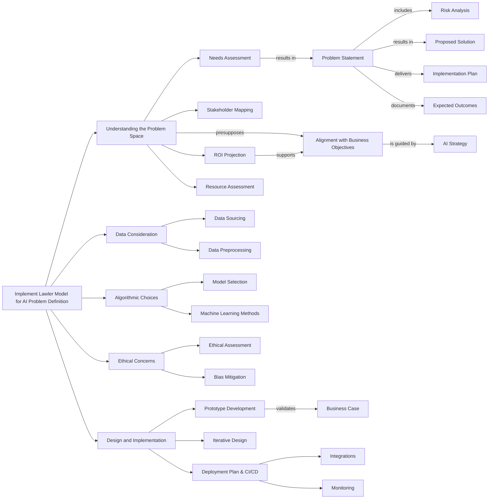

# E2E Problem definition and solution   

Based on the Lawler Model.

 
 

- [Lawler Model for designing AI Products](https://cdotimes.com/2023/09/21/the-lawler-model-for-designing-ai-products-a-bloomberggpt-case-study/) - this is an ad-infested website, open with a blocker. 
- [Thinkable models](https://www.sciencedirect.com/science/article/abs/pii/S0732312396900048)