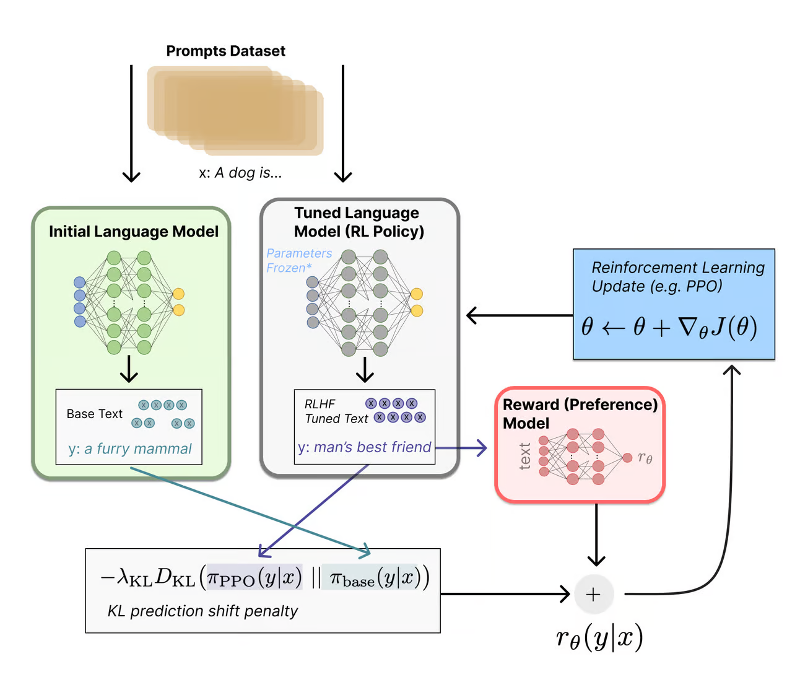

# RLHF 

Reinforcement Learning from Human Feedback (RLHF) is a machine learning technique that incorporates human input to enhance the training and performance of AI models, particularly LLM's. As the name indicates, RLHF goes beyond traditional reinforcement learning, which relies on predefined reward functions and environmental feedback where the agent learns through trial and error by interacting with a simulated or real environment. RLHF: Incorporates human feedback directly into the learning process, providing guidance, preferences, or demonstrations to shape the model's behavior.

By directly incorporating human feedback into the training process, RLHF helps build alignment with human-defined goals, values and preferences. RLHF matters because models trained with RLHF often outperform those trained solely through traditional reinforcement learning methods by providing the models with feedback and data on their output. HUman feedback leads to faster convergence to optimal solutions and reduces the time and resources required for training and improvement. 

Human feedback in RLHF helps models avoid risky or undesirable actions, enhancing their safety and robustness. This is especially critical in applications where safety is paramount, such as autonomous vehicles or healthcare decision support systems.

Furthermore, RLHF is particularly useful for training models with complex parameters, such as understanding the emotional context of text or music, which are difficult to capture through traditional methods.

 

## Types of RLHF

Let me break down the main types of Reinforcement Learning from Human Feedback (RLHF) approaches, moving from simplest to more sophisticated:

__Binary Feedback RLHF__

- Also known as Binary Critique, this is the naivest form of RLHF.
- Simplest form where humans provide thumbs up/down or yes/no feedback, like the one you often see when interacting with commercial offerings
- Each response is rated as either good or bad
- Used to train a reward model through simple binary classification
- Easy to collect at scale but provides limited granularity
- Example: Having humans flag toxic vs non-toxic responses

__Scalar Rating RLHF__

- Humans rate responses on a numerical scale (e.g., 1-5 or 1-10)
- Provides more granular feedback than binary
- Can capture degrees of quality/preference
- Simple to collect
- Example: Rating responses from 1-5 on helpfulness

__Comparative RLHF__

There is __Binary Trajectory__ where users compare two possible answers from the model and indicate which one they prefer. And there is also __Multiple Trajectory Rankings__, where similarly the user ranks multiple trajectories from best to worst.

- Humans compare two or more model outputs and pick the better one
- Creates a preference ranking between responses
- More reliable than absolute ratings since relative judgments are easier
- More expensive to collect than single-response ratings
- Example: Choosing between two possible answers to a question

__Structured Feedback RLHF__

Unlike standard RLHF, which often relies on binary or scalar feedback, Structured Feedback RLHF allows human evaluators to provide more nuanced and specific feedback on different aspects of the model's output.

- Humans provide feedback along multiple specific dimensions. These might include aspects like
  - Accuracy of information
  - Relevance to the prompt
  - Tone and style 
  - Ethical considerations
  - Coherence and logical flow
- May include rubrics or detailed evaluation criteria, or a  hierarchical approach to reward modeling. What that means is that instead of a single reward score, the system uses a structured set of rewards that correspond to different aspects of the model's performance. This hierarchical structure allows for more sophisticated optimization and learning.
- Can target different aspects like accuracy, safety, helpfulness
- More complex to collect but provides richer training signal
- Example: Rating responses separately on accuracy, clarity, and safety

__Interactive RLHF__
- Humans engage in multi-turn interactions and provide feedback
- Can capture context-dependent preferences
- Allows for dynamic adjustment of model behavior
- More complex to implement and scale
- Example: Having humans engage in dialogues and rate each turn

__Decomposed RLHF__
- Breaking down complex tasks into subtasks with separate feedback
- Allows for more targeted training of specific capabilities
- Can help identify which aspects need improvement
- Requires careful task decomposition
- Example: Separately evaluating reasoning steps and final answers

__Multi-agent RLHF__
- Using multiple AI agents to generate and evaluate responses
- Human feedback used to train both generators and evaluators
- Can potentially scale beyond human feedback bottleneck
- More complex architecture, management and training process
- Example: Having one model generate responses and another critique them

__Supervised Fine-Tuning__

- Fine-tunes on curated human-written responses
- Direct learning from high-quality examples
- Limited in capturing complex preferences
- May not generalize well to new scenarios
- Relatively simple to implement

__Proximal Policy Optimization (PPO)__

- Uses RL with a separate reward model, iteratively updated
- More complex to implement and computationally intensive
- Proven to be effective, well researched and widely used as it is more sophisticated than other methods

__Direct Preference Optimization (DPO)__

- Directly uses preference data, hence simpler than PPO
- Formulates alignment as classification
- Often more efficient, albeit relatively new, less extensively tested

__Rejection Sampling__

[Rejection sampling](https://rlhfbook.com/c/10-rejection-sampling.html) operates by curating new candidate instructions, filtering them based on a trained reward model, and then fine-tuning the original model only on the top completions.

- Multiple outputs are generated from the model for each prompt
- A reward model or other evaluation metric is used to score these outputs
- The highest-scoring samples are selected, while lower-scoring ones are rejected, which keeps only the most preferred or highest-quality outputs according to the reward model
- The efficiency depends on the cost of sampling and evaluation compared to alternative methods
- Considered a basic or baseline method in many RLHF (Reinforcement Learning from Human Feedback) implementations
- Particularly useful in language model alignment tasks
- Less computationally expensive than PPO

__RLAIF__ - Reinforcement Learning from AI Feedback

- Uses AI-generated feedback to train the reward model instead of human feedback, including off-the-shelf LLMs
- Therefore, it is more scalable by reducing human labor given that putting together a dataset of human preferences is both resource-intensive and time-consuming
- Potential for transfer of AI Biases
- May not be as accurate and nuanced as human-provided preferences

There is also d-RLAIF, which obtains rewards directly from an LLM and simplifies or outperforms canonical RLAIF, but is very dependant on the quality of the feedback generated by the LLM used.

__Intuitive Fine-Tuning__

- Integrates SFT and RLHF
- Balancing intuitive learning with explicit alignment
- Offers the efficiency of SFT with performance close to RLHF

__Constitutional AI__

[Created by Anthropic](https://www.anthropic.com/news/collective-constitutional-ai-aligning-a-language-model-with-public-input) as a method to align general purpose language models by making them abide by a set of normative principles, similar to a constitution.

- Uses AI feedback based on predefined principles
- Allows for explicit encoding of values and principles

 

## How does human input and feedback transfer back to the model?

Human evaluators provide feedback on the model's outputs, typically by comparing pairs of model responses and indicating their preference and annotating or rating individual outputs into a separate dataset that also contains the original prompts, the model responses and the evaluations from humans.

This preference dataset is then used to train a reward model, which learns to predict human preferences, essentially translating human judgments into a numerical reward signal.

The original language model is copied to create what is calle an __RL policy model__. This model generates new responses to prompts which are subsequently evaluated by the reward model, which assigns them a score based on predicted human preference. The RL policy is then updated using reinforcement learning algorithms (often [Proximal Policy Optimization](https://arxiv.org/abs/1707.06347)) to maximize the reward. This process creates a feedback loop where the model continuously improves its outputs to better align with human preferences.

This process can then be iteratively applied, with fine-tuned models redeployed and their outputs undergoing further human evaluation, which adds to the preference data from previous iterations. The reward model can be periodically updated with this new data, and the LLM retrained with the updated reward model. 

*Source: https://huggingface.co/blog/rlhf*

## How does RLFH matter for Trustworthy AI and AI model auditing

Knowing and understanding the RLHF process involved in training a particular model is highly relevant for Trustworthy AI and AI model auditing, given that the purpose of RLHF is precisely aligning models' behavior with human preferences and values. Therefore, this is very closely related to ethical concerns and aspects of social responsibility. 

Understanding how RLHF was carried out is important to assess the following

- bias in AI models as well as what was done to mitigate those biases
- transparency and interpretability of AI systems, including explainable decisions easier to understand by users
- ethical concerns such as harmlessness of outputs, honesty and helpfulness, meaning that outputs are not only technically correct but also helpful to users

Different RLHF techniques, such as SFT, PPO or DPO can have a varying impact on the resulting trustworthiness of the model, which is something the auditor needs to take into account. SImilarly, the feedback process itself is not exempt from introducing new biases, or reinforce existing ones, so it is important to examine how the process was managed. 

The following aspects seem very relevant for auditing or assessing the trustworthiness of an AI model:

- the diversity and quality of human feedback sources
- the methods used to integrate feedback into the model
- the impact of RLHF on various trustworthiness metrics such as toxicity, bias, truthfulness, privacy and so on
- the consistency and calibration of human evaluators
- the long-term effects of RLHF on model behavior and performance

 

## Challenges and limitations

- __Expertise Problem__: Human feedback can be noisy and varies in reliability depending on the expertise of the human teacher. Current RLHF algorithms often fail to account for this variability, which can impact the effectiveness of the training.
- __Hallucination in Multimodal Models__: Multimodal Large Language Models (MLLMs) often generate text that is not factually grounded in associated images, making them untrustworthy. Techniques like RLHF-V aim to address this by using fine-grained correctional human feedback to reduce hallucinations.
- __Generalization vs. Diversity__: RLHF improves out-of-distribution generalization but tends to reduce output diversity compared to supervised fine-tuning (SFT). This trade-off needs to be managed depending on the application.
- __Computational Efficiency__: Traditional RLHF methods require significant computational resources. Techniques like low-rank adaptation (LoRA) have been shown to achieve better performance with fewer resources, making RLHF more efficient.

 

# Sources

## Books

- [The RLHF book](https://rlhfbook.com/) - or as [pdf](https://rlhfbook.com/book.pdf)

## Papers

- [A Survey of Reinforcement Learning from Human Feedback](https://arxiv.org/abs/2312.14925)
- [Value Imprint - A Technique for Auditing the Human Values Embedded in RLHF Datasets](https://openreview.net/forum?id=fq7WmnJ3iV#discussion)
- [Proximal Policy Optimization Algorithms](https://arxiv.org/abs/1707.06347)
- [Reinforced Self-Training (ReST) for Language Modeling](https://arxiv.org/abs/2308.08998)
- [Open Problems and Fundamental Limitations of Reinforcement Learning from Human Feedback](https://arxiv.org/abs/2307.15217) - [overview](https://andlukyane.com/blog/paper-review-rlhf-overview)
- [RLHF-V: Towards Trustworthy MLLMs via Behavior Alignment from Fine-grained Correctional Human Feedback](https://arxiv.org/abs/2312.00849)
- [Understanding the Effects of RLHF on LLM Generalisation and Diversity](https://arxiv.org/abs/2310.06452)
- [Summary of ChatGPT-Related Research and Perspective Towards the Future of Large Language Models](https://arxiv.org/abs/2304.01852)
- [RS-DPO: A Hybrid Rejection Sampling and Direct Preference Optimization Method for Alignment of Large Language Models](https://arxiv.org/abs/2402.10038)
- [Statistical Rejection Sampling Improves Preference Optimization](https://arxiv.org/abs/2309.06657)
- [RLAIF - Scaling Reinforcement Learning from Human Feedback with AI Feedback](https://openreview.net/forum?id=AAxIs3D2ZZ)
- [RLAIF vs. RLHF: Scaling Reinforcement Learning from Human Feedback with AI Feedback](https://arxiv.org/abs/2309.00267)
- [Intuitive Fine-Tuning: Towards Simplifying Alignment into a Single Process](https://arxiv.org/abs/2405.11870)
- [Constitutional AI: Harmlessness from AI Feedback](https://arxiv.org/abs/2212.08073)

### Collections

- [A GitHub repo with more papers on RLHF](https://github.com/opendilab/awesome-RLHF) as well as explanations and graphics
- [And another one](https://github.com/louieworth/awesome-rlhf)
- [RLHF Papers - HuggingFace](https://huggingface.co/collections/heegyu/rlhf-papers-652fb32fb00993b8bb0d53ab)

