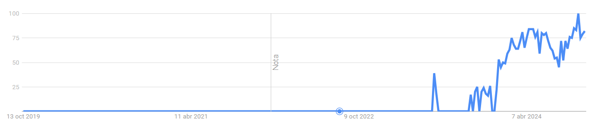

# On the term 'Trustworthy AI'

The topic of Trustworthy AI has garnered significant attention in recent years due to the rapid development and deployment of AI technologies. This interest is driven by the need to ensure that AI systems are safe, fair, explainable, and accountable, among other factors. 

*Google Trends for 'Trustworth AI' for the last five years as of October '24.*

There has been a tremendous amount of research on trustworthy AI in recent years, focusing on various dimensions such as safety, fairness, explainability, privacy, accountability, as well as environmental considerations. 

Trustworthy AI is a large and complex subject, involving various dimensions as defined for example in [1]. Six of the most crucial dimensions in achieving trustworthy AI:
- Safety & Robustness
- Nondiscrimination & Fairness
- Explainability
- Privacy
- Accountability & Auditability 
- Environmental Well-being 

One of notable initiatives that have let to the popularization of this concept was the European Commission’s (EC) High-Level Expert Group (HLEG) on AI, with the document [Ethics Guidelines for Trustworthy AI (2019)](https://www.europarl.europa.eu/cmsdata/196377/AI%20HLEG_Ethics%20Guidelines%20for%20Trustworthy%20AI.pdf) [1], not without a number of criticisms over the contested term itself, one of which is probably that of *ethics-washing* to defuse regulation and offer a façade of ethics high ground while continuing to conduct business as usual, as explored in [3]. In the meantime, technology evolves and operates at a faster pace than regulation, mired in ethical debates that dilute its effect. The most scathing criticism, as exposed in [1] comes however from inside the HLEG itself:

> *The Trustworthy AI story is a marketing narrative invented by industry, a bedtime story for tomorrow's customers. The underlying guiding idea of a “trustworthy AI” is, first and foremost, conceptual nonsense. Machines are not trustworthy; only humans can be trustworthy (or untrustworthy) ... the Trustworthy AI narrative is, in reality, about developing future markets and using ethics debates as elegant public decorations for a large-scale investment strategy.* 
[source](https://www.tagesspiegel.de/politik/ethics-washing-made-in-europe-5937028.html)

At the same time, the author admits this initiative is “currently the best 
globally available platform for the next phase of discussion”. It might not be the best tool, but is the best tool we have now.

## Caveats

The term itself can be a bit laden and potentially a misnomer (or a [nonsense](https://philarchive.org/archive/FREMSOv1), even) which some vendors could be pushing in order to drive the hype to their favour or sell their services. In fact, all major vendors are pushing their capalities and assessment checklists.

- **Lack of standard definition**. it can be said there is no unversally accepted definition of what TAI is, but regulators and research is converging on a specific set of principles and areas that I think offer a good enough definition.

- **Oversimplification**: Trust is relational, context-dependent, and earned over time. Simply labeling an AI system as "trustworthy" doesn’t account for the deeper, more nuanced aspects of human trust or the need for ongoing scrutiny as AI evolves. It can also drive forward the perilous tendency to trust AI / ML outputs by default. 

- **False attribution**: in the wake of the previous point, we might end up  attributing responsibilities to agents who cannot be held responsible, which poses interesting problems regarding accountability and liability as we remove or depart from the human (or anthropocentric, if you will) nature of trust. philosophers of technology and ethicists of AI oppose to the term ‘Trustworthy AI’ considering that trust cannot be associated with technology. When we anthropomorphize AI-based technologies, such as robots or digital assistants like Siri or Alexa, we often assign them moral status and a degree of moral consideration, and when we misplace trust we assign responsibilities to agents that are ultimately non-moral [4].

- **Confusing Trust with Reliance / Reliability**: in the same manner we rely on electricity, but we don't "trust" it. There is no moral aspect to reliance, only the expectation, or probability, that the technology will perform successfully in alignment with a set of baseline criteria that we are trying to define. __"*trust in AI systems is plausible only to the extent that we include human agents as the targets of trust, thereby framing AI systems as socio-technical systems that include human agents*"__ [7]. Maybe '**Reliable AI**' would be a better term, as some of the papers referenced argue. 

- **AI as our Peers**: As argued against in [5], "*no human should need to trust an AI system, because it is both possible and desirable to engineer AI for accountability. We do not need to trust an AI system, we can know how likely it is to perform the task assigned, and only that task. When a system using AI causes damage, we need to know we can hold the human beings behind that system to account.*" 

- **Epistemological impossiblity or difficulty of 'Trustworthy AI'**:  *the AI system must be (i) capable of fulfilling the trustor's expectation by being reliable; (ii) self-assess and monitor the system's limitations and promises to those who trust it; (iii) account for the interests and values of those who trust it (focusing on the most vulnerable groups of users); and (iv) require information disclosure about the inner working of the system and its goals, including financial interests.* From [4], [7]

This being said, we will go with the flow as the term is already well spread and probably will not go away, as it is a convenient term for use in the industry even if maybe conflated by some. 

# Papers

- [1] [Trustworthy AI: A Computational Perspective](https://arxiv.org/pdf/2107.06641). This paper offers a comprehensive appraisal of trustworthy AI from a computational perspective to help readers understand the latest technologies for achieving trustworthy AI across multiple dimensions.

- [2] [Trustworthy AI: From Principles to Practices](https://dl.acm.org/doi/pdf/10.1145/3555803). This paper presents a framework for important aspects AI trustworthiness, including robustness, generalization, explainability, transparency, reproducibility, fairness, privacy preservation, and accountability. These aspects are systematically organized while considering the entire lifecycle of AI systems, ranging from data acquisition to model development, to system development and deployment, finally to continuous monitoring and governance. The goal is to offer actionable items for practitioners and stakeholders to improve the trustworthiness of AI models. 

- [3] [The Contestation of Tech Ethics: A Sociotechnical Approach to Technology Ethics in Practice](https://arxiv.org/abs/2106.01784)

- [4] [Making Sense of the Conceptual Nonsense ‘Trustworthy AI’](https://philarchive.org/archive/FREMSOv1). This interesting paper examines the term "Trustworthy AI" in ethical discussions surrounding AI. The author argues that this concept is fundamentally flawed because it attributes human-like qualities, such as trustworthiness, to technologies that inherently lack these qualities. The paper goes on to examine the term from the theoretical roots of trust and social epistemology, too long to repeat here. 

- [5] [AI & Global Governance: No One Should Trust AI](https://unu.edu/cpr/blog-post/ai-global-governance-no-one-should-trust-ai) - This short article explains why  trust relations can only exist among peers - which AIs and humans are not, and also attacks the claims that accountability is impossible to trace and maintain, for example not the case in incidents with self-driving cars. Underlying both points is that humans are running institutions, which are complex and autonomous, but still accountable.

- [6] [In AI We Trust: Ethics, Artificial Intelligence, and Reliability](https://link.springer.com/article/10.1007/s11948-020-00228-y), which explores that the object of trust can be (i) the AI technology itself; (ii) the people and organizations behind the AI; and (iii) the socio-technical systems as a whole, and, again, that trust cannot be directed at AI, since it is problematic to associate human moral activities 
with AI. In the normative account of trust, the trustor's expectations are directed not only on what the trustee will do, but also on what they should do. From the side of the trustee, it entails a motivation to be morally responsible for their actions - a normative commitment. In this case, too, AI is not capable of being morally responsible for its actions.

- [7] [Mapping the Stony Road toward Trustworthy AI](https://papers.ssrn.com/sol3/papers.cfm?abstract_id=3717451). The authors are skeptical about “recent efforts to sell trustworthy AI as a ready-made label or brand" (ibid). The moral requirements of their account of trust can only be met by cultivating a 'trustworthy AI culture'. 

