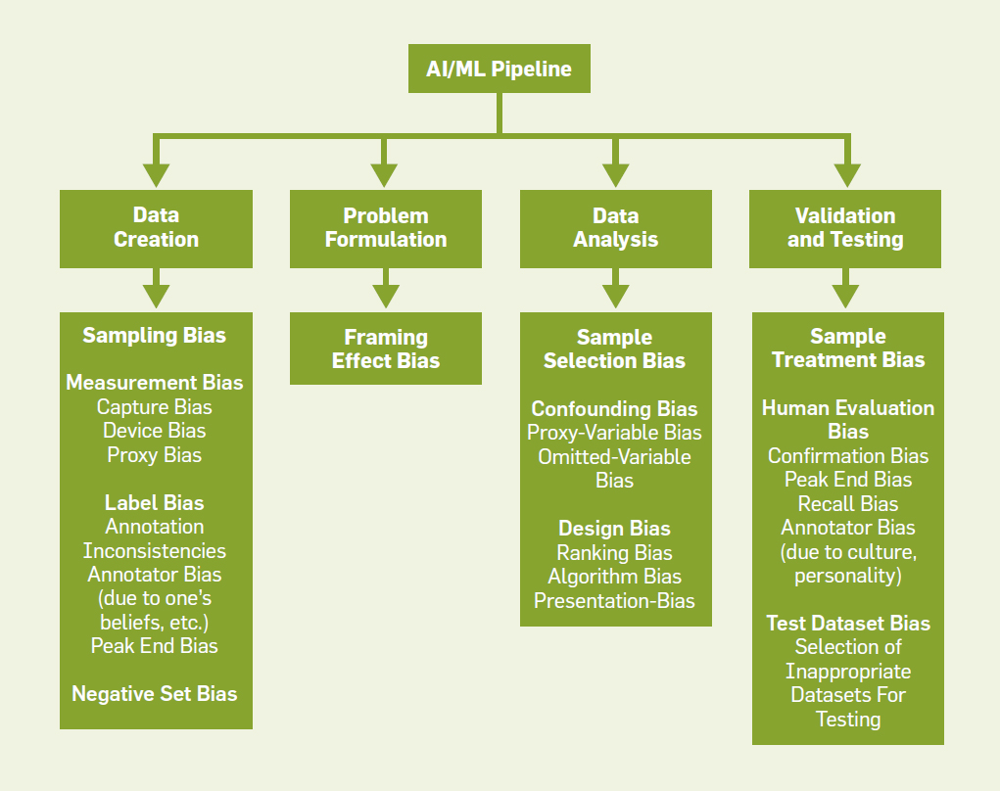
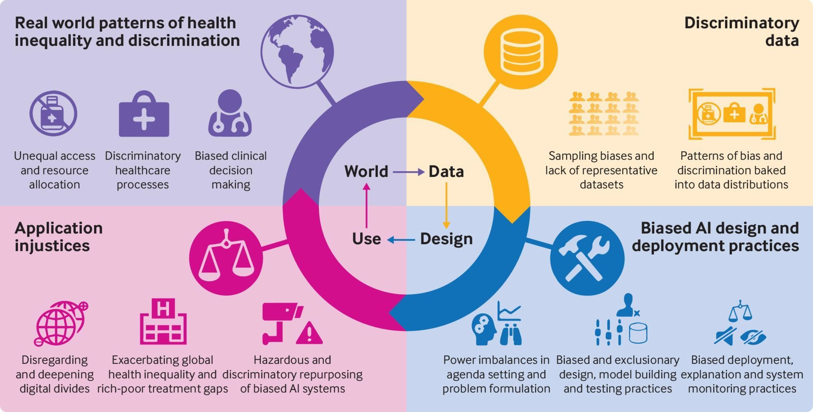

## Basic types of biases 

- Algorithmic Bias - Occurs when the algorithm itself is designed in a way that leads to biased outcomes, often due to flawed assumptions or prejudiced hypotheses.
- [Data Bias](https://www.zendata.dev/post/ai-bias-101-understanding-and-mitigating-bias-in-ai-systems)
  - Selection Bias - When the training data is not representative of the population it's meant to model.
  - Reporting Bias - When the frequency of events in training data doesn't accurately - reflect reality.
  - Measurement Bias - Caused by errors or inconsistencies in data collection or  measurement processes.
  - Incomplete data
- Human Bias
  - Cognitive Bias Unconscious errors in thinking that affect judgments and decisions made by humans involved in AI development.
  - Prejudice Bias -  When existing societal prejudices and stereotypes are reflected in the training data or algorithm design.
- Racial Bias - When AI systems discriminate against certain racial or ethnic groups, often due to underrepresentation in training data.
- Gender Bias - When AI systems favor one gender over another or reinforce gender stereotypes.
- Age Bias (Ageism) - When AI systems marginalize or stereotype individuals based on age.
- Confirmation Bias - When AI systems are designed to rely too heavily on pre-existing beliefs or trends in the data.
- Out-group Homogeneity Bias - When AI systems are less capable of distinguishing between individuals who are not part of the majority group in the training data.
- Sample Bias - When the training data is not large or diverse enough to represent the full population.
- Label Bias - Occurs during data labeling when labels are inconsistently applied or reflect subjective biases.
- Aggregation Bias - When a model works well for the overall population but performs poorly for specific subgroups.
- Historical Bias - When AI models trained on historical data reflect past prejudices and societal inequalities.

--- 

[source](https://cacm.acm.org/practice/biases-in-ai-systems/)

## The Bias Cycle

[source](https://www.weforum.org/agenda/2021/07/ai-machine-learning-bias-discrimination/)

## Links

- [Bias in AI: What it is, Types, Examples & 6 Ways to Fix it](https://research.aimultiple.com/ai-bias/)
- [AI Bias 101: Understanding and Mitigating Bias in AI Systems](https://www.zendata.dev/post/ai-bias-101-understanding-and-mitigating-bias-in-ai-systems)
